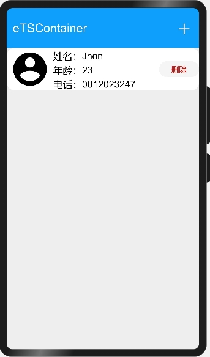
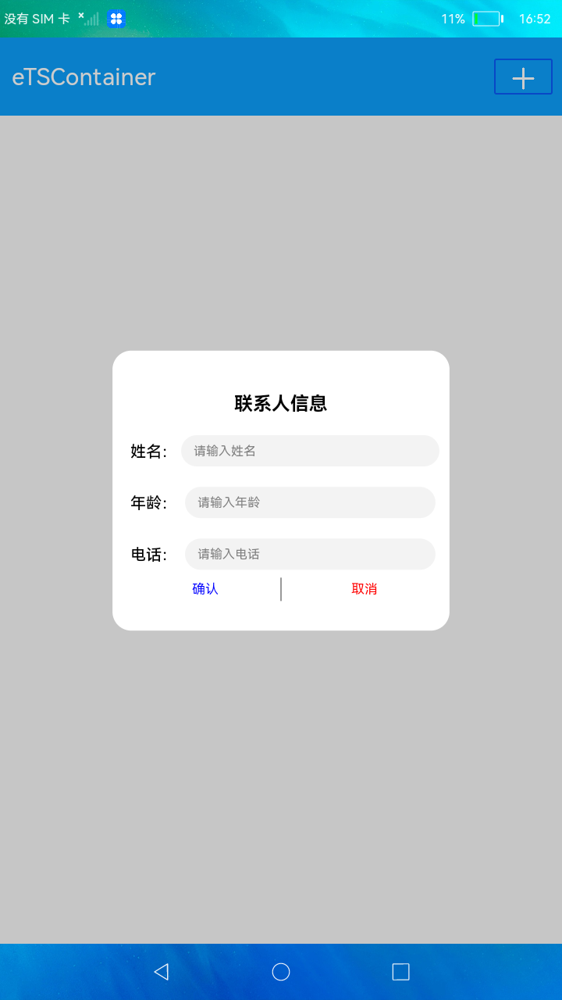

# 线性容器ArrayList

### 简介

本示例通过线性容器 ArrayList 模拟了添加删除联系人的操作，展示了 ArrayList 相关的接口功能。效果图如下：

### 相关概念

- [线性容器ArrayList](https://gitee.com/openharmony/docs/blob/master/zh-cn/application-dev/reference/apis/js-apis-arraylist.md)：ArrayList是一种线性数据结构，底层基于数组实现。

### 相关权限

不涉及

### 使用说明

1.点击屏幕右上方的 **+** 按钮，弹出添加联系人窗口。

2.在弹窗中填写姓名等相关信息。

3.点击弹窗的**确认**按钮后信息保存，并展示在主页面中。

4.点击**删除**按钮，删除对应联系人信息。

### 约束与限制

1.本示例仅支持在标准系统上使用。

2.本示例需要使用DevEco Studio 3.0 Beta3 (Build Version: 3.0.0.901, built on May 30, 2022)才可编译运行。