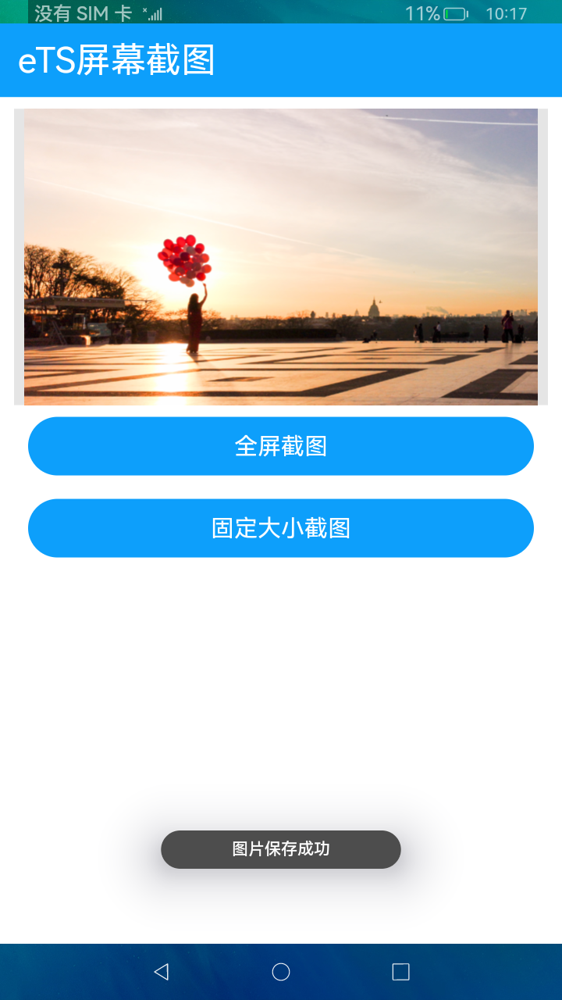

# 屏幕截图

### 简介

 此Demo展示eTS项目中如何使用screenshot接口获取屏幕截图。实现效果如下：



### 相关概念

-  屏幕截图：提供获取当前屏幕截图的api，返回获取到的PixelMap信息。

### 相关权限

```
本示例需要在module.json5中配置如下权限:

获取屏幕截图权限：ohos.permission.CAPTURE_SCREEN
```

### 使用说明

1. 点击**全屏截图**，获取全屏截图并保存到图库中。

2. 点击**固定大小截图**，获取固定大小截图并保存到图库中。

### 约束与限制

1.本示例仅支持标准系统上运行。

2.本示例为Stage模型，从API version 9开始支持。

3.本示例需要使用DevEco Studio 3.0 Beta3 (Build Version: 3.0.0.901, built on May 30, 2022)才可编译运行。