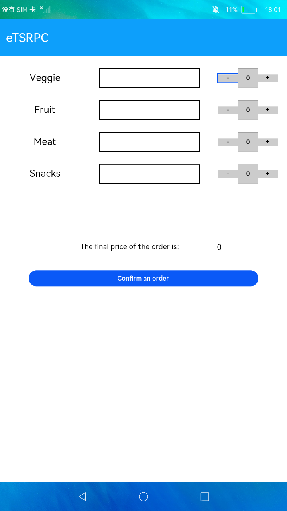
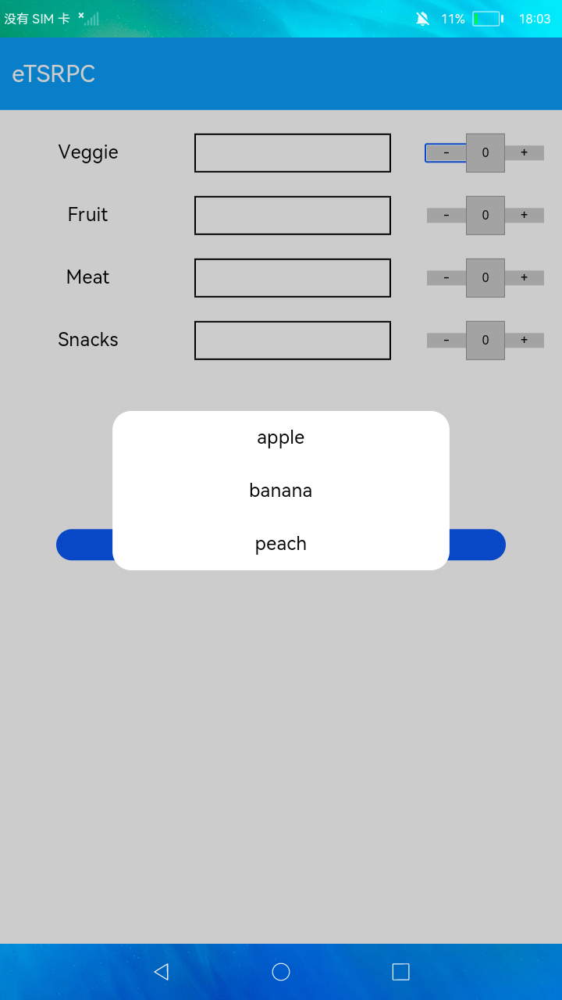

# RPC连接

### 简介

本示例展示了同一设备中前后台的数据交互，用户前台选择相应的商品与数目，后台计算出结果，回传给前台展示。效果图如下：

### 相关概念

- [RPC通信](https://gitee.com/openharmony/docs/blob/master/zh-cn/application-dev/reference/apis/js-apis-rpc.md)：该类提供读写基础类型及数组、IPC对象、接口描述符和自定义序列化对象的方法。

### 相关权限

不涉及

### 使用说明

1. 点击商品种类的空白方框，弹出商品选择列表，选择点击对应的商品，空白方框显示相应内容。

2. 点击商品选择框后的 **+** 或  **-** 按钮，选择商品所对应的数量。

3. 点击 **Confirm an order** 按钮，根据相应的菜品数量与单价，计算出总价并显示。

### 约束与限制

1.本示例仅支持在标准系统上运行。

2.本示例需要使用DevEco Studio 3.0（Beta3Build Version: 3.0.0.901, built on May 30, 2022)才可编译运行。