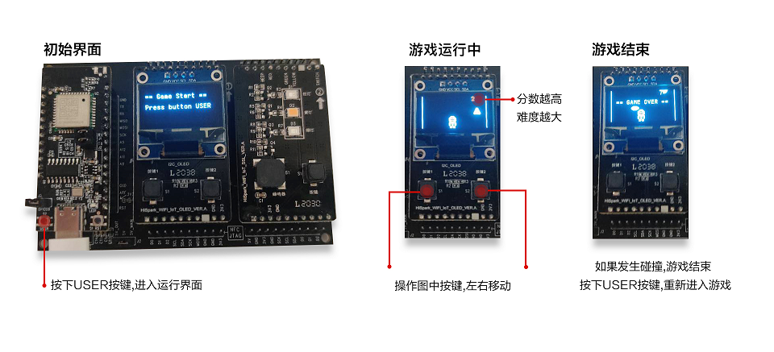

# 太空人避障游戏

### 简介

本Sample是基于OpenHarmony轻量级系统，利用内核的实时性和丰富的外设拓展功能，运行在Hi3861 WLAN模组上的应用游戏。

实现效果如下：



### 使用说明

#### 1. 编译步骤

1.拷贝本Sample目录下的common、astronauts_game 文件夹到OpenHarmony 系统源码中的applications/sample/wifi-iot/app目录下。

2.修改applications/sample/wifi-iot/app/BUILD.gn 文件，在features字段中增加索引，使目标模块参与编译。features字段指定业务模块的路径和目标，具体配置如下。

```  
    import("//build/lite/config/component/lite_component.gni")
    
    lite_component("app") {
    features = [
        "astronauts_game",
    ]
    deps = [ "//applications/sample/wifi-iot/app/common/hals:hals" ]
}

```
3.修改hi3861 内核配置文件

​    打开 device/hisilicon/hispark_pegasus/sdk_liteos/build/config/usr_config.mk 文件

​    将 CONFIG_I2C_SUPPORT is not set这一行，   改为CONFIG_I2C_SUPPORT=y

​    将 CONFIG_PWM_SUPPORT is not set这一行，   改为CONFIG_PWM_SUPPORT=y

4.代码编译和烧录请参考：[链接](https://gitee.com/openharmony/docs/blob/master/zh-cn/device-dev/quick-start/quickstart-lite-steps-hi3861.md)

#### 2. 游戏玩法如下

1.上电后进入游戏初始界面，按下开发板中的user按键开始游戏。

2.使用OLED拓展板上的按键1、按键2左右移动来躲避随机落下的障碍物。

3.屏幕右上角会记录得分，难度会随着分数的增加而提高。

4.如果碰撞到障碍物和OLED屏左右末端，则游戏结束。

5.按下user按键重新开始游戏。


### 约束与限制

1.本示例仅支持在标准系统上运行。

2.本示例需要使用DevEco Studio 3.0 Beta3 (Build Version: 3.0.0.901, built on May 30, 2022)才可编译运行。