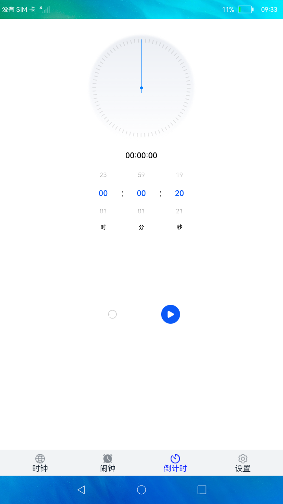

# 翻页时钟

### 简介

 本示例运用OpenHarmony系统提供的FA模型与相关接口展示了一个简易的时钟。 实现效果如下：

### 相关概念

- 后台代理提醒：后台代理提醒主要提供后台提醒发布接口，开发者在应用开发时，可以调用这些接口去创建定时提醒，包括倒计时、日历、闹钟三种提醒类型。使用后台代理提醒能力后，应用可以被冻结或退出，计时和弹出提醒的功能将被后台系统服务代理。

### 相关权限

后台代理提醒权限：ohos.permission.PUBLISH_AGENT_REMINDER

### 使用说明

1. 主页面有四个底部标签栏，时钟页面展示了数字翻页时钟功能。
2. 闹钟功能点击**+**号可以创建一个闹钟，等闹钟时间到了会进行提醒。
3. 倒计时功能。
4. 设置里边实现的功能有全屏、调节屏幕亮度和不熄屏。

### 约束与限制

1.本示例仅支持在标准系统上运行。

2.本示例需要使用DevEco Studio 3.0 Beta3 (Build Version: 3.0.0.901, built on May 30, 2022)才可编译运行。
