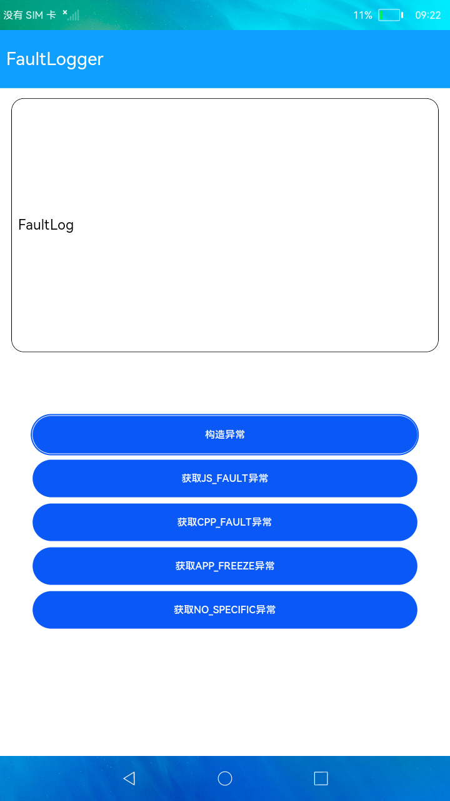

# 故障日志获取

### 简介

本示例展示了在eTS中如何获取应用故障相关信息。实现效果如下：

### 相关概念

-  FaultLogInfo：获取到的故障信息的数据结构。

-  querySelfFaultLog：获取当前进程故障信息，该方法通过回调方式获取故障信息数组，故障信息数组内最多上报10份故障信息。

### 相关权限

不涉及

### 使用说明

1.启动应用后，点击**构造异常**按钮，在弹窗中选择故障类型，点击确定可以构造异常场景。

2.构造异常场景后，重新启动应用，点击下面不同的获取异常按钮可以获取到对应类型的异常日志并显示在页面文本框中。

### 约束与限制

1.本示例仅支持标准系统上运行。

2.本示例需要使用DevEco Studio 3.0 Beta3 (Build Version: 3.0.0.901, built on May 30, 2022)才可编译运行。