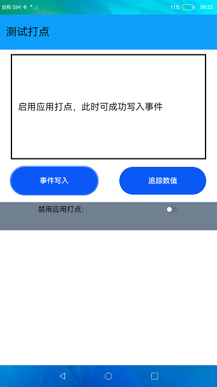

# 测试打点

### 简介

1.测试打点包括应用打点与性能打点两部分。

2.应用打点通过调用`hiAppEvent`接口来记录应用运行过程中发生的各种信息。

本示例展示了在eTS中如何获取应用故障相关信息。实现效果如下：

### 相关概念

-  应用打点：本模块提供了应用事件打点能力，包括对打点数据的落盘，以及对打点功能的管理配置。

### 相关权限

不涉及

### 使用说明

1.点击"事件写入"按钮，显示成功写入事件。

2.打开"禁用应用打点"开关，再次点击"事件写入"按钮，显示事件写入失败。

3.关闭"禁用应用打点"开关，再次点击"事件写入"按钮，显示事件写入成功。

### 约束与限制

1.本示例仅支持在标准系统上运行。

2.性能打点验证只能通过上述命令获取日志来进行验证。

3.本示例需要使用DevEco Studio 3.0 Beta3 (Build Version: 3.0.0.901, built on May 30, 2022)才可编译运行。