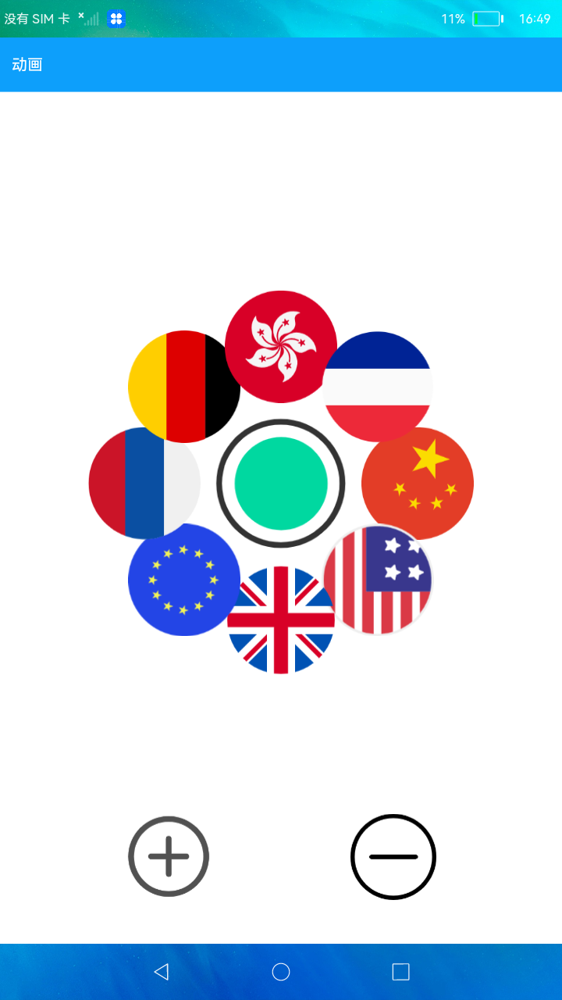

# 动画

### 简介

本示例通过点击按钮触发动画，向用户展示属性动画与显示动画的效果。效果图如下：

### 相关概念

- [属性动画](https://gitee.com/openharmony/docs/blob/master/zh-cn/application-dev/reference/arkui-ts/ts-animatorproperty.md)：组件的通用属性发生变化时，可以创建属性动画进行渐变，提升用户体验。

- [显式动画](https://gitee.com/openharmony/docs/blob/master/zh-cn/application-dev/reference/arkui-ts/ts-explicit-animation.md)：提供全局animateTo显式动画接口来指定由于闭包代码导致的状态变化插入过渡动效。

### 相关权限

不涉及

## 使用说明

1.点击屏幕中的圆形图片，播放显示动画展开其它图片，实现整体的旋转与位移变换。再次点击主屏幕中间圆形图片，将其它图片收拢。

2.点击展开后的任一图片，播放属性动画，实现图片的自转、缩放与透明度变换。

3.点击页面下方加号按钮，将增加图片数量；点击减号按钮，将减少图片数量。图片数量最多增加至8张，最少减少至3张，默认为3张。

## 约束与限制

1.本示例仅支持在标准系统上运行。

2.本示例需要使用DevEco Studio 3.0（Beta3Build Version: 3.0.0.901, built on May 30, 2022)才可编译运行。