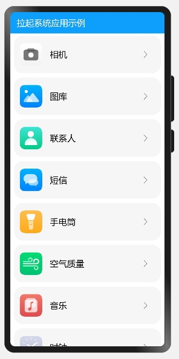

# 拉起系统应用示例

## 简介

本示例使用FeatureAbility接口，通过应用的包名与Ability名，拉起系统应用。效果图如下：

### 相关概念

- [FeatureAbility模块](https://gitee.com/openharmony/docs/blob/master/zh-cn/application-dev/reference/apis/js-apis-featureAbility.md)：FeatureAbility模块。

### 相关权限

不涉及

### 使用说明

选择想要拉起的应用，点击拉起应用。

### 约束与限制

1.本示例仅支持在标准系统上运行。

2.本示例需要使用DevEco Studio 3.0 Beta3 (Build Version: 3.0.0.901, built on May 30, 2022)才可编译运行。