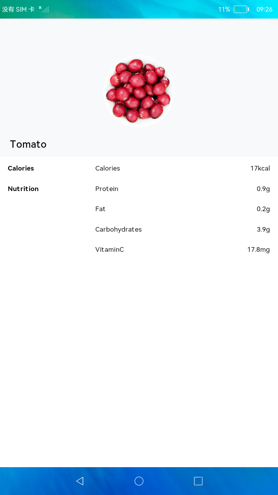

# 创建简单视图

## 简介

本示例通过展示食物番茄的图片和营养信息，主要为了展示简单页面的Stack布局和Flex布局。

实现效果如下：

### 相关概念

-  Stack：堆叠容器，子组件按照顺序依次入栈，后一个子组件覆盖前一个子组件。

### 相关权限

不涉及

## 使用说明

此页面为静态页面，无用户交互。

## 约束与限制

1.本示例仅支持在标准系统上运行。

2.本示例需要使用DevEco Studio 3.0 Beta3 (Build Version: 3.0.0.901, built on May 30, 2022)才可编译运行。