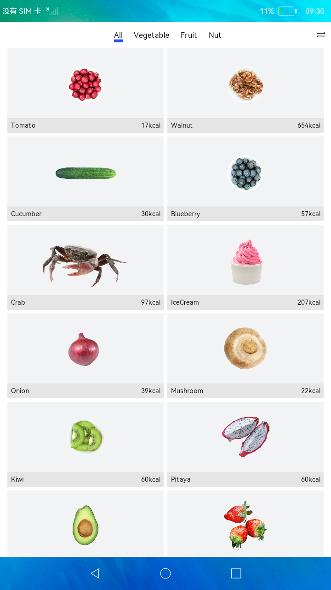

# 页面布局和连接

## 简介

本示例构建食物分类列表页面和食物详情页，包含：

1.List布局：创建食物数据模型，ForEach循环渲染ListItem。

2.Grid布局：展示食物分类信息，创建Tabs页签展示不同分类的食物。

3.路由机制：router接口、Navigator和页面间数据传递。

实现效果如下：

### 相关概念

-  List：列表包含一系列相同宽度的列表项。适合连续、多行呈现同类数据，例如图片和文本。

-  Grid：网格容器，由“行”和“列”分割的单元格所组成，通过指定“项目”所在的单元格做出各种各样的布局。

### 相关权限

不涉及

## 使用说明

1.点击首页的切换按钮，可切换List和Grid布局。

2.点击食物单元，可跳转到食物详情页。

## 约束与限制

1.本示例仅支持在标准系统上运行。

2.本示例需要使用DevEco Studio 3.0 Beta3 (Build Version: 3.0.0.901, built on May 30, 2022)才可编译运行。