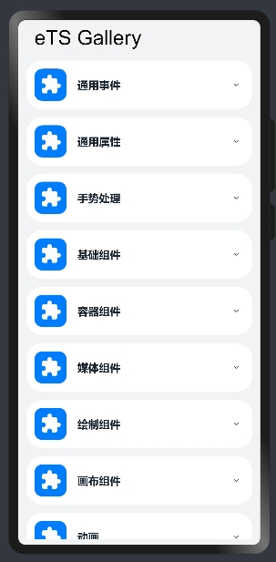

# 组件集合

### 简介

本Demo通过不同示例向用户介绍通用事件、通用属性、手势处理等不同组件的功能。效果图如下：

### 相关概念

- [基于TS扩展的声明式开发范式](https://gitee.com/openharmony/docs/blob/master/zh-cn/application-dev/reference/arkui-ts/Readme-CN.md)：基于TS扩展的声明式开发范式。

### 相关权限

不涉及

### 使用说明

1.主页面选择组件菜单，在菜单中选择组件示例。

2.按照示例提示体验组件功能。

3.点击返回图片，返回主页面。

### 约束与限制

1.本示例仅支持在标准系统上运行。

2.本示例需要使用DevEco Studio 3.0（Beta3Build Version: 3.0.0.901, built on May 30, 2022)才可编译运行。