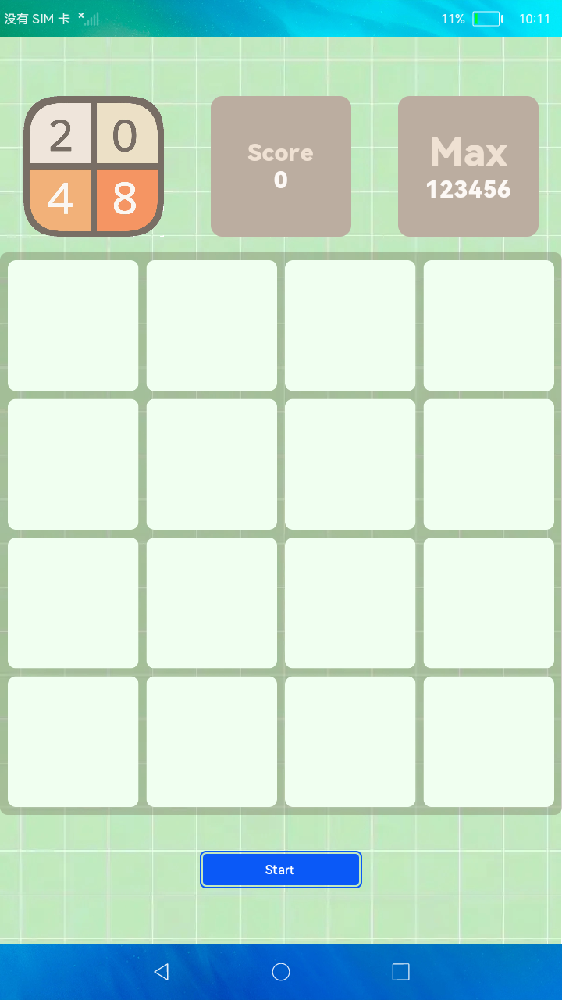

# 游戏2048

### 简介

2048是一款比较流行的数字游戏，此游戏demo是grid组件基础上进行开发完成的。效果图如下：

### 相关概念

- [Grid](https://gitee.com/openharmony/docs/blob/master/zh-cn/application-dev/reference/arkui-ts/ts-container-grid.md)：网格容器，由“行”和“列”分割的单元格所组成，通过指定“项目”所在的单元格做出各种各样的布局。

### 相关权限

不涉及

### 使用说明

1.每次可以选择上下左右其中一个方向去滑动，每滑动一次，所有的数字方块都会往滑动的方向靠拢外，系统也会在空白的地方随机出现一个数字方块， 相同数字的方块在靠拢、相撞时会相加。

2.当所有数字方块都无法有效滑动时，游戏结束。

### 约束与限制

1.本示例仅支持在标准系统上运行。

2.本示例需要使用DevEco Studio 3.0（Beta3Build Version: 3.0.0.901, built on May 30, 2022)才可编译运行。