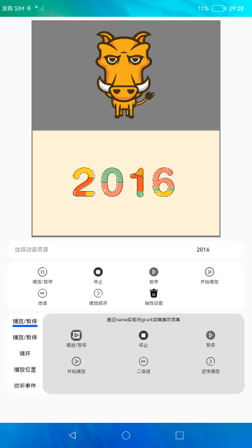

# lottie

### 简介

本示例构建了lottie对动画的操作功能。实现控制动画的播放、暂停、倍速播放、播放顺序、播放到指定帧停止或从指定帧开始播放、侦听事件等功能，动画资源路径必须是json格式。

### 相关概念

加载动画：须提前声明Animator('__lottie_ets')对象，并在Canvas完成布局后调用。可配合Canvas组件生命周期接口使用。

canvas：画布组件，用于自定义绘制图形。

### 相关权限

不涉及。

### 使用说明

1.进入页面默认开始2016动画，点击**请选择**进行选择动画资源。

2.上面部分播放暂停是对两个动画进行控制，下面部分播放暂停功能是对grunt动画控制。

3.点击销毁动画功能之后需要重新选择动画资源才可以进行其余功能操作。

### 约束与限制

1.本示例支持标准系统上运行。

2.本示例需要使用DevEco Studio 3.0 Beta3 (Build Version: 3.0.0.901, built on May 30, 2022)才可编译运行。