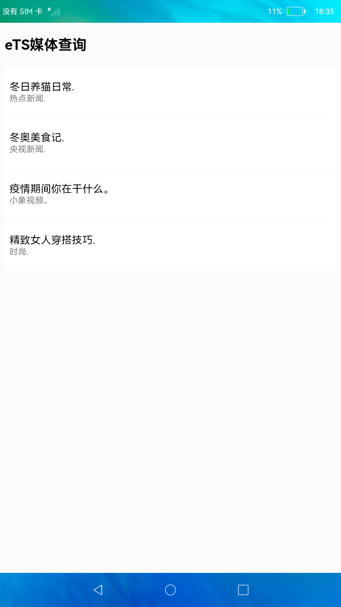
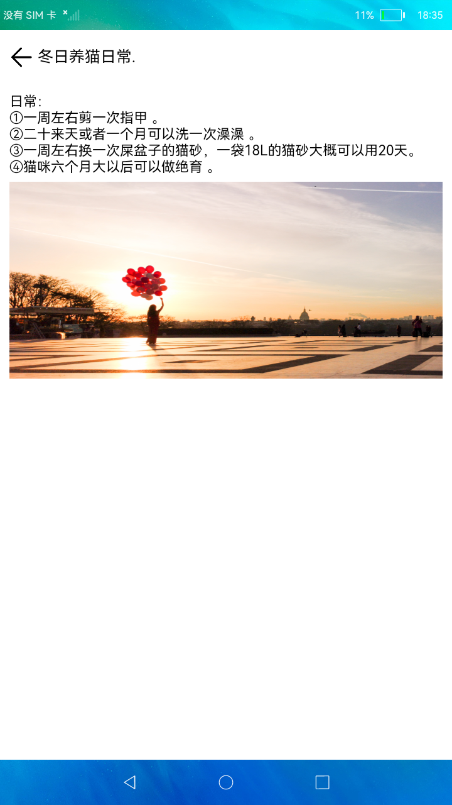

# 媒体查询

### 简介

此Demo展示如何使用媒体查询，完成在不同设备上显示不同的界面效果。实现效果如下：

 

### 相关概念

-  MediaQueryListener：媒体查询的句柄，并包含了申请句柄时的首次查询结果。
- on(type: 'change', callback）方法：通过句柄向对应的查询条件注册回调，当媒体属性发生变更时会触发该回调。

### 相关权限

不涉及

### 使用说明

1.在竖屏设备上，首页展示新闻列表，点击新闻进入详情界面。

2.在横屏设备上，首页左侧展示新闻列表，右侧显示新闻详情，点击新闻右侧显示所点击的新闻的详情。

### 约束与限制

1.本示例仅支持标准系统上运行。

2.本示例需要使用DevEco Studio 3.0 Beta3 (Build Version: 3.0.0.901, built on May 30, 2022)才可编译运行。
