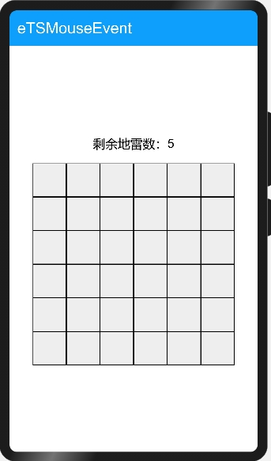

# 鼠标事件

### 简介

本示例模拟了简单的扫雷游戏调用了鼠标事件的相关接口。效果图如下：

### 相关概念

- [鼠标输入事件](https://gitee.com/openharmony/docs/blob/master/zh-cn/application-dev/reference/apis/js-apis-mouseevent.md)：设备上报的鼠标事件。

### 相关权限

不涉及

### 使用说明

1.扫雷规则：左键打开方格，方格显示的数字为方格周围一圈的地雷数目（9代表地雷），右键标记地雷方格且剩余地雷数目-1，若标记错误游戏结束，当剩余地雷数目为0时，玩家获得胜利游戏结束。

2.移动鼠标悬停在界面中的灰色方格中，方格颜色变浅。

3.在空白方格上点击鼠标左键，空白方格中出现数字，被标记的方格无反应。

4.在空白方格上点击鼠标右键，空白方格被标红，若此格不为地雷格弹出弹窗，显示游戏结束，若此格为地雷格剩余地雷数目-1游戏继续。

5.在数字方格上点击鼠标中键，数字方格周围一圈的的空白方格闪烁，打开或标记为地雷的方格不闪烁。

6.点击弹窗按钮**重新开始**，游戏界面刷新，开启新一局游戏。

7.点击弹窗按钮**退出游戏**，游戏结束应用关闭。

### 约束与限制

1.本示例正常测试需要外接鼠标，仅支持在标准系统上运行。

2.本示例需要使用DevEco Studio 3.0 Beta3 (Build Version: 3.0.0.901, built on May 30, 2022)才可编译运行。
