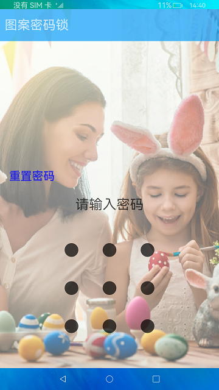

# 图案密码锁组件

### 简介

本示例展示了图案密码锁组件的使用，实现了密码设置、验证和重置功能。实现效果如下：

### 相关概念

- [图案密码锁组件](https://gitee.com/openharmony/docs/blob/master/zh-cn/application-dev/reference/arkui-ts/ts-basic-components-patternlock.md)：以宫格图案的方式输入密码，用于密码验证。手指触碰图案密码锁时开始进入输入状态，手指离开屏幕时结束输入状态并向应用返回输入的密码。
### 相关权限

不涉及

### 使用说明

1.首次进入时需要设置密码，需要两次输入密码相同后点击**设置密码**进行设置，如果第二次输入密码和第一次输入密码不不同，会提示重新输入。

2.设置密码后，需要输入密码解锁，退出应用后重新进入应用，需要再次输入密码验证，密码验证成功进入主页。

3.设置密码后，在输入密码界面有**重置密码**按钮，点击后需要输入旧密码，旧密码验证成功后开始设置新的密码。

### 约束与限制

1.本示例仅支持标准系统上运行。

2.本示例为stage模型，从API version 9开始支持。

3.本示例需要使用3.0.0.901及以上的DevEco Studio版本才可编译运行。