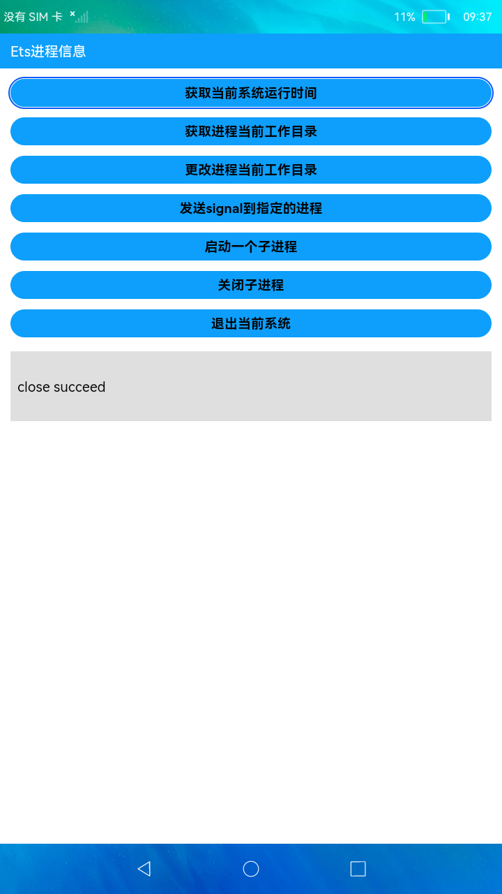

# 进程信息

### 简介

本示例展示了在eTS中如何获取进程信息和启动一个子进程运行一段shell，包括当前系统运行时间、获取进程当前工作目录、更改进程当前工作目录、发送signal到指定的进程、启动一个子进程、关闭子进程、退出当前系统的功能。实现效果如下：

### 相关概念

-  process：提供获取进程相关信息的api接口。

### 相关权限

不涉及

### 使用说明

首页中展示了各个功能按钮，点击相应的按钮完成该功能代码运行。

### 约束与限制

1.本示例支持标准系统上运行。

2.本示例需要使用DevEco Studio 3.0 Beta3 (Build Version: 3.0.0.901, built on May 30, 2022)才可编译运行。
