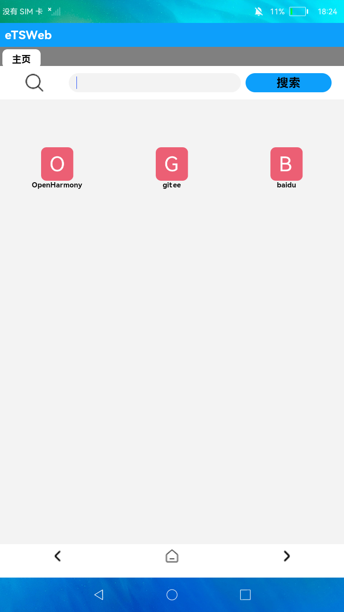

# Web

### 简介

本示例主要展示了web的功能页面。实现效果如下：

# 相关概念

提供具有网页显示能力的Web组件。

### 相关权限

本示例需要在module.json5中配置如下权限:

网络使用权限：ohos.permission.INTERNET

### 使用说明

1.点击应用进入主页面，点击主页面相应的图标可进入相应的网页。

2.在浏览多级网页后，可以通过点击**底部导航条**可实现进入上一级网页、下一级网页、进入主页面等操作。

3.网页正在加载时可以点击顶部的**X图标**停止网页的加载。网页加载完成后，点击顶部的**刷新**图标可以对网页进行刷新。

4.点击顶部的**网址输入框**，可以看到最近浏览的网页，并点击进入相应的网页。也可以输入新的网址，并点击**搜索**按钮加载网页。

### 约束与限制

1.本示例仅支持在标准系统上运行。

2.本示例需要使用DevEco Studio 3.0 Beta3 (Build Version: 3.0.0.901, built on May 30, 2022)才可编译运行。