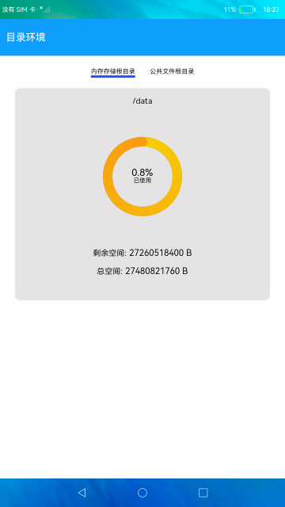

# 目录环境

### 简介

本示例展示了内存存储和公共文件根目录对应的内存大小。实现效果如下：

### 相关概念

目录环境能力：该模块提供环境目录能力，获取内存存储根目录、公共文件根目录的JS接口。

### 相关权限

不涉及

### 使用说明

1.通过顶部两个页签可切换内存存储和公共文件相关存储情况。

2.页签下方首行显示存储路径，接着以圆环展示已使用空间及占比，最下方展示剩余和总空间大小，公共文件暂不支持空间大小相关信息展示。

### 约束与限制

1.本示例仅支持在标准系统上运行。

2.本示例需要使用DevEco Studio 3.0 Beta3 (Build Version: 3.0.0.901, built on May 30, 2022)才可编译运行。