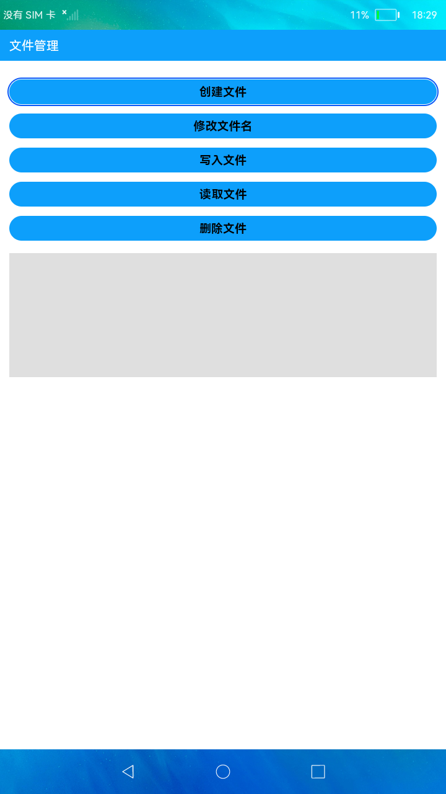

# 文件管理

### 简介

本示例展示了文档管理的部分功能，例如：创建文件、修改文件名、文件写入、文件读取、删除文件。

### 相关概念

文件管理：提供文件存储管理能力，包括文件基本管理、文件目录管理、文件信息统计、文件流式读写等常用功能。

### 相关权限

不涉及

### 使用说明

1.点击"创建文件"按钮，创建文件，创建成功，Toast显示文件的绝对路径。

2.点击"修改文件名"按钮，修改文件名，修改成功，Toast显示修改文件名后的绝对路径。

3.点击"写入文件"按钮，向文件中写入内容，写入成功，Toast显示文件写入的内容。

4.点击"读取文件"按钮，读取文件中的内容，读取成功，文本框中显示读取到的内容。

5.点击"删除文件"按钮，删除文件，Toast显示文件删除成功。

### 约束与限制

1.本示例仅支持在标准系统上运行。

2.本示例需要使用DevEco Studio 3.0 Beta3 (Build Version: 3.0.0.901, built on May 30, 2022)才可编译运行。