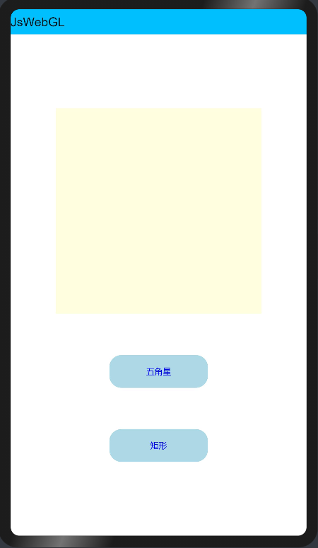
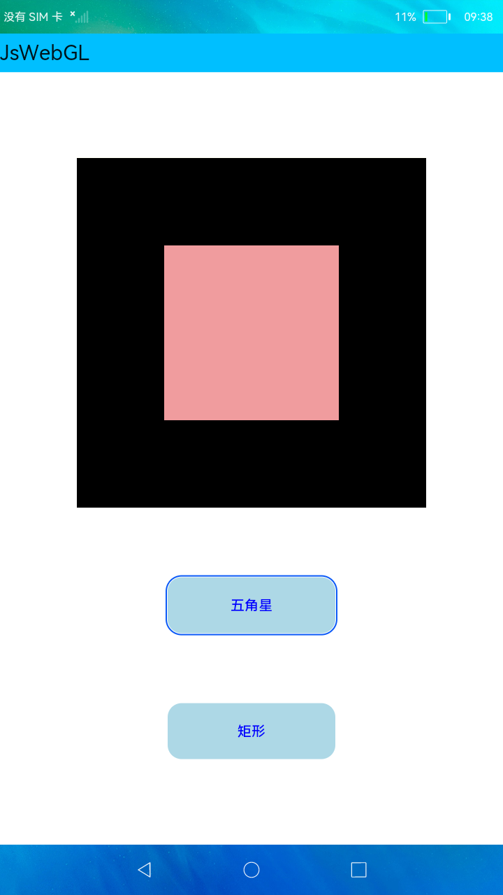

### WebGL

##### 简介

本示例调用GPU资源绘制了五角星和矩形，展示WebGL相关接口的使用方法。效果图如下：

### 相关概念

- [webgl](https://gitee.com/openharmony/docs/blob/master/zh-cn/application-dev/reference/apis/js-apis-webgl.md)：WebGL标准图形API，对应OpenGL ES 2.0特性集。更多信息请参考WebGL™标准。

### 相关权限

不涉及

##### 使用说明

1.点击**五角星**按钮，画布展示五角星图案。

2.点击**矩形**按钮，画布更新图像为红色矩形。

##### 约束与限制

1.本示例仅支持在标准系统上运行。

2.设备必须具备调用GPU资源的能力（3516不支持，RK3568支持）。

3.本示例需要使用DevEco Studio 3.0（Beta3Build Version: 3.0.0.901, built on May 30, 2022)才可编译运行。