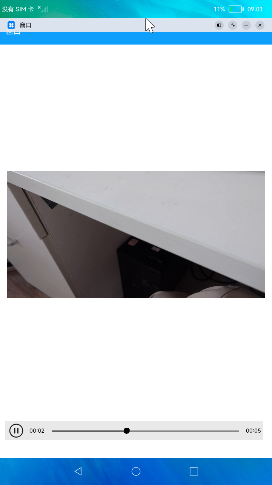
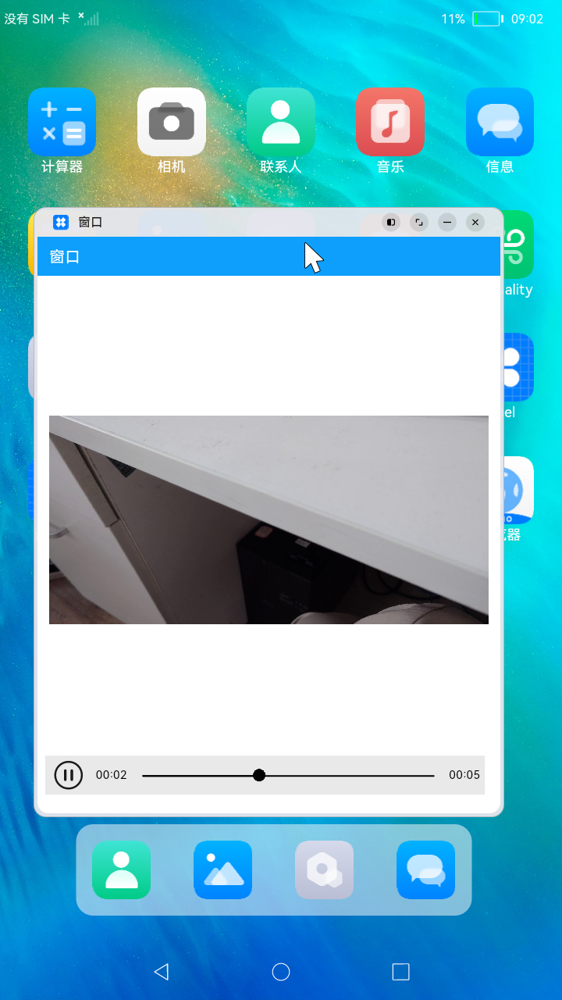

# 窗口

### 简介

本示例展示了创建新窗口，将应用悬浮在其他界面，及应用分屏等功能。效果图如下：

### 相关概念

- [窗口](https://gitee.com/openharmony/docs/blob/master/zh-cn/application-dev/reference/apis/js-apis-window.md)：窗口提供管理窗口的一些基础能力，包括对当前窗口的创建、销毁、各属性设置，以及对各窗口间的管理调度。

### 相关权限

不涉及

### 使用说明

1.启动应用，点击视频可播放视频，再次点击视频暂停。

2.在应用顶部，下滑出现窗口操作。

3.点击分屏图标，将应用上下分屏，再次点击取消分屏显示。

4.点击悬浮图标，将应用悬浮展示在其他界面上，再次点击取消悬浮显示。

5.点击减号按钮，将应用最小化，再次点击应用，应用显示。

6.点击关闭按钮，关闭应用。

### 约束与限制

1.本示例仅支持标准系统上运行。

2.本示例为stage模型，从API version 9开始支持。

3.本示例需要使用DevEco Studio 3.0（Beta3Build Version: 3.0.0.901, built on May 30, 2022)才可编译运行。