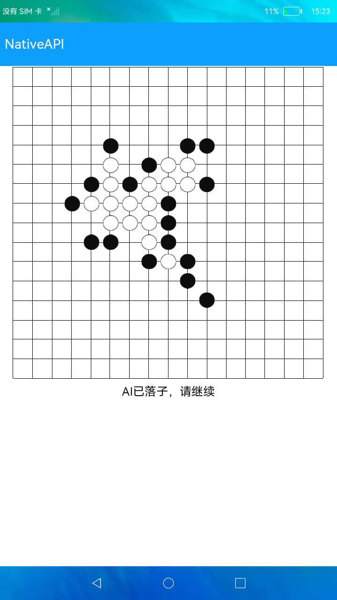

# NativeAPI

### 简介

本示例展示了在eTS中如何调用C++的接口以及C++如何回调JS，完成了一个简单的五子棋游戏，在native层完成计算逻辑，eTS完成界面绘制和刷新。

NativeAPI的使用见[NativeAPI使用指导](https://gitee.com/openharmony/docs/blob/master/zh-cn/application-dev/napi/napi-guidelines.md)。

实现效果如下：

### 相关概念

-  NativeAPI：IDE中会包含使用Native API的默认工程，使用`File`->`New`->`Create Project`创建`Native C++`模板工程。创建后在`main`目录下会包含`cpp`目录，可以使用ace_napi仓下提供的napi接口进行开发。

### 相关权限

不涉及

### 使用说明

1.启动应用，进入应用，界面显示空的棋盘，本示例AI为黑子，用户为白子。点击**开始游戏**，AI先落子。

2.用户点击棋盘中的交叉点完成放置白子，AI会自动计算位置并落黑子。

3.游戏胜利或失败，会弹窗提示并清空棋盘。

### 约束与限制

1.本示例仅支持标准系统上运行。

2.本示例需要使用DevEco Studio 3.0 Beta3 (Build Version: 3.0.0.901, built on May 30, 2022)才可编译运行。