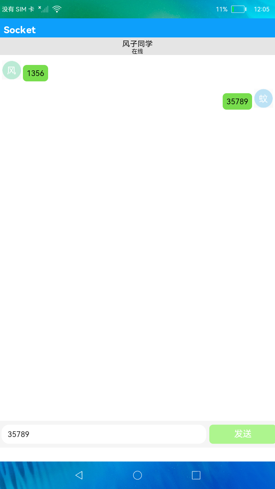

#  网络管理-Socket连接

### 简介

本示例主要演示了Socket在网络通信方面的应用，展示了Socket在两端设备的连接验证、聊天通信方面的应用。

#相关概念

UDP Socket是面向非连接的协议，它不与对方建立连接，而是直接把我要发的数据报发给对方，适用于一次传输数据量很少、对可靠性要求不高的或对实时性要求高的应用场景。

### 相关权限

1.网络权限: "ohos.permission.INTERNET"

2.获取WIFI信息的权限: "ohos.permission.GET_WIFI_INFO"

### 使用说明

1.打开应用，点击**用户**文本框选择要登录的用户，并输入另一个设备的IP地址，点击**确定**按钮进入已登录的用户页面（两个设备都要依次执行此步骤）。
 
2.在其中一个设备上点击**创建房间**按钮，任意输入房间号，另一个设备会收到有房间号信息的弹框，点击**确定**按钮后，两个设备进入聊天页面。

3.在其中一个设备上输入聊天信息并点击**发送**按钮后，另一个设备的聊天页面会收到该聊天消息。

4.点击顶部标题栏右侧的**退出**图标按钮，则返回已登录的用户页面。

5.点击聊天页面中的昵称栏，会弹出一个菜单，选择离线选项后，两端设备的状态图标都会切换为离线图标，并且昵称栏都会变成灰色，此时任何一端发送消息另一端都接收不到消息。

6.当点击昵称栏再次切换为在线状态，则两端的己方账号状态会切换为在线图标，同时两端的昵称栏会显示蓝色，此时可正常收发消息。

### 约束与限制

1.本示例仅支持在标准系统上运行。

2.本示例需要使用DevEco Studio 3.0 Beta3 (Build Version: 3.0.0.901, built on May 30, 2022)才可编译运行。