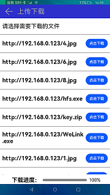

# 上传下载

### 概要简介

上传就是将文件从个人手机传送至远程服务器，下载是将文件从远程服务器传送至个人手机，进而实现文件的存储，该示例使用上传下载的接口实现文件的上传下载，实现效果如下：

### 相关概念

上传下载：上传下载模块提供了对文件的上传下载能力。

### 相关权限

本示例需要在config.json中配置如下权限:

"reqPermissions": [{"name": "ohos.permission.INTERNET"}]

### 使用说明

1.启动应用，获取权限后系统会访问远程服务器，将远程服务器的文件列表显示，选择要下载到本机的文件，点击**点击下载**按钮，远端服务器的文件就会下载到本机，文件的下载进度下方会显示。

2.点击下一页，页面会跳转到上传页面，点击**点击上传**按钮，本机的文件会上传至远端服务器，上传进度下方会显示。

### 约束与限制

1.本示例仅支持标准系统上运行。

2.本示例需要使用DevEco Studio 3.0 Beta3（Build Version: 3.0.0.901, built on May 30, 2022)才可编译运行

3.默认支持https，如果要支持http，需要在config.json里增加network标签，属性标识 "cleartextTraffic": true。即：
"deviceConfig": {
    "default": {
        "network": {
            "cleartextTraffic": true
        }
    }
}