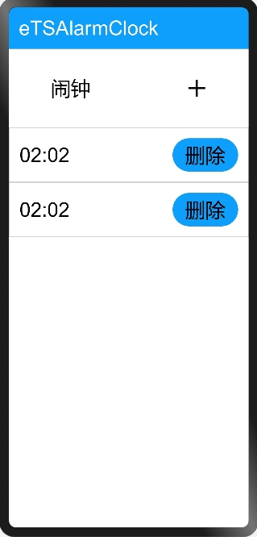

# 后台代理提醒

### 简介

本示例通过模拟闹钟来展示后台代理提醒的使用方法。



### 相关概念

使用后台代理提醒能力后，应用可以被冻结或退出，计时和弹出提醒的功能将被后台系统服务代理。

### 相关权限

```
本示例需要在config.json中配置如下权限:

后台代理提醒权限：ohos.permission.PUBLISH_AGENT_REMINDER
```

### 使用说明

1.点击“**+**”，选择闹钟时间，点击“**确认**”，发布后台代理提醒事件，系统时间到达后会发布一条通知。

2.点击“**删除**”，删除后台代理提醒事件。

### 约束与限制

1.本示例仅支持在标准系统上运行。目前系统暂不支持响铃。

2.本示例需要使用DevEco Studio 3.0 Beta3 (Build Version: 3.0.0.901, built on May 30, 2022)才可编译运行。