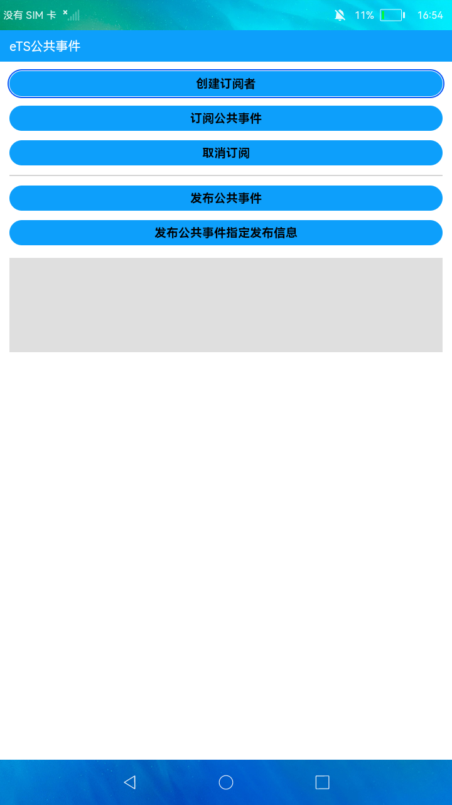

# 订阅公共事件

### 简介

本示例展示了在eTS中如何使用CommonEvent的接口完成创建订阅者、订阅公共事件、发布公共事件、取消订阅的功能。实现效果如下：

### 相关概念

- CommonEvent：每个应用都可以订阅自己感兴趣的公共事件，订阅成功后且公共事件发布后，系统会把其发送给应用。这些公共事件可能来自系统、其他应用和应用自身。HarmonyOS提供了一套完整的API，支持用户订阅、发布和接收公共事件。

### 相关权限

不涉及

### 使用说明

1.页面中先点击**创建订阅者**、**订阅公共事件**，下方编辑框中显示执行结果；然后点击**发布公共事件**和**发布公共事件指定发布信息**，下方编辑框中展示公共事件发布成功后接收到的公共事件信息，点击**取消订阅**可以取消公共事件订阅。

### 约束与限制

1.本示例仅支持标准系统上运行。

2.本示例需要使用DevEco Studio 3.0 Beta3 (Build Version: 3.0.0.901, built on May 30, 2022)才可编译运行。