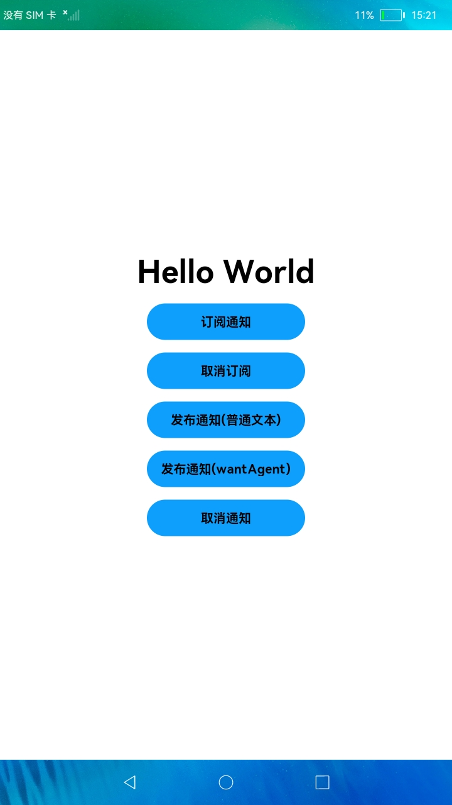

# 订阅、发送通知

### 简介

本示例展示了在eTS中如何使用Notification的接口完成通知订阅、取消订阅、发布通知、取消通知功能。实现效果如下：

### 相关概念

- 发布通知：使用 Notification.publish接口发布通知。
- 订阅通知：创建订阅者并实现接收通知回调函数，可以实现监听通知的功能。
-  NotificationRequest：设置要发布通知内容的NotificationRequest对象。

### 相关权限

不涉及

### 使用说明

1.点击**订阅通知**，可以接收到应用发布的通知，点击**取消订阅**可以取消通知订阅。

2.执行通知发布前，先要确认通知发送使能是否开启，新安装的应用使能默认是关闭状态，需要到通知设置里开启。

3.这里举例了两种类型的通知发送，点击**发布通知**，如果本应用已订阅了通知，下方有接收到通知信息提示框，SystemUI默认订阅所有通知，所以SystemUI通知栏里也会有通知显示。点击**取消通知**可以取消前面最近的一个通知。

### 约束与限制

1.本示例仅支持标准系统上运行。

2.本示例为Stage模型，从API version 9开始支持。

3.本示例需要使用3.0.0.901及以上的DevEco Studio版本才可编译运行。

