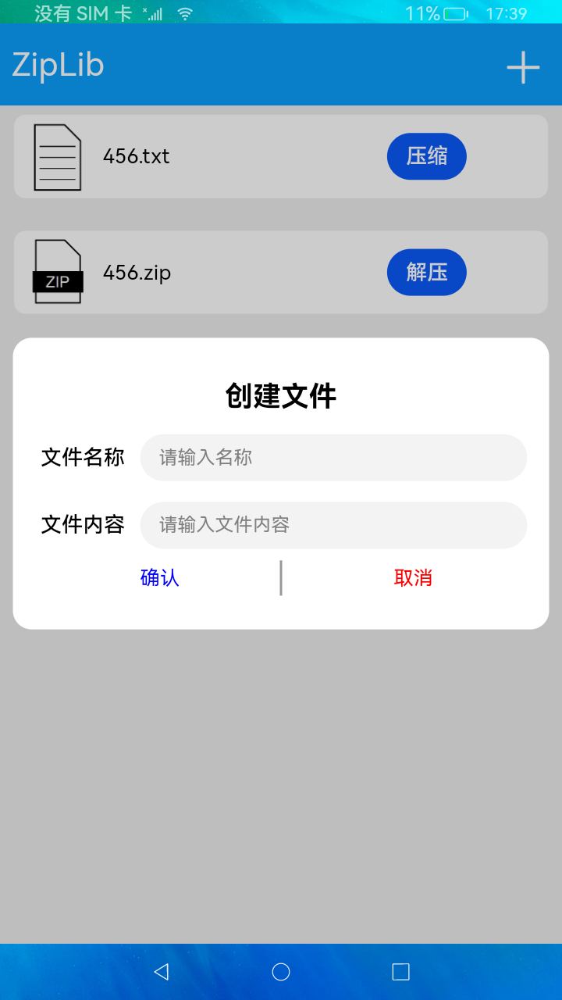
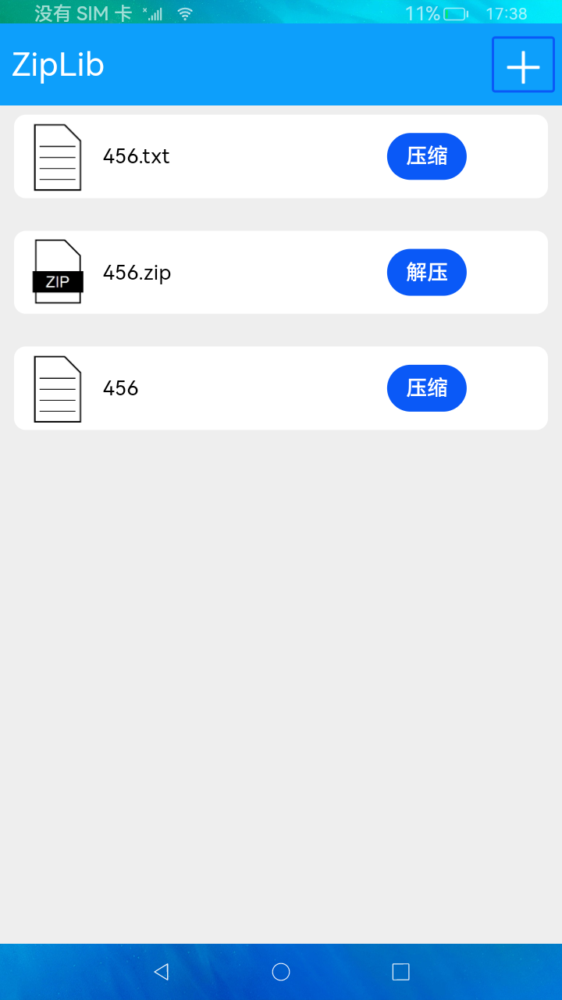

# 压缩与解压

### 简介

本示例通过构建解压，压缩文件场景，向用户展示`@ohos.zlib`接口，具体实现效果如下图。

### 相关概念

[压缩](https://gitee.com/openharmony/docs/blob/master/zh-cn/application-dev/reference/apis/js-apis-zlib.md#zlibzipfile)：通过传入的压缩文件路径与压缩后生成文件路径来对文件或目录进行压缩。

[解压](https://gitee.com/openharmony/docs/blob/master/zh-cn/application-dev/reference/apis/js-apis-zlib.md#zlibunzipfile)：通过传入的待解压文件路径与解压后生成文件路径来对文件或目录进行解压。

### 使用说明

1.点击屏幕右上角 **+** 按钮，弹出创建文件窗口。

2.输入文件名称、文件内容，并点击 **确定** 按钮来创建文件。

3.文件创建成功后，在主页面会显示，点击 **压缩** 按钮，提示“文件压缩成功”，并会在文件列表创建一个相同名称的`.zip`文件。

4.点击压缩文件后的 **解压** 按钮，提示“文件解压成功”，并会再次在文件列表创建一个同名文件夹。

### 约束与限制

1.本示例仅支持在标准系统上运行。

2.本示例需要使用3.0.0.901及以上的DevEco Studio版本才可编译运行。

3.解压与压缩相关接口的入参路径必须为 `context` 相关接口获取的相对路径，目前该接口仅支持操作应用目录下的文件。