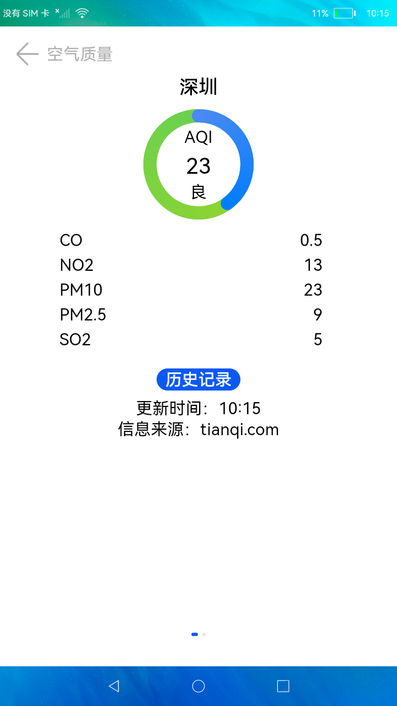

# 空气质量

### 简介
空气质量（Air quality）的好坏反映了空气污染程度，它是依据空气中污染物浓度的高低来判断的。空气污染是一个复杂的现象，在特定时间和地点空气污染物浓度受到许多因素影响。来自固定和流动污染源的人为污染物排放大小是影响空气质量的最主要因素之一，本示例实现了一个简单空气质量应用，使用折行显示能力显示空气质量信息，使用柱形图展示历史记录。效果图如下：

### 相关概念
空气质量：检测空气污染程度。

### 相关权限
不涉及

### 使用说明

1.点击桌面应用图标，启动应用。

2.在首页展示空气质量信息，左右滑动可以切换城市。

3.点击**历史记录**按钮可以跳转到历史记录页面，此界面用柱形图展示历史记录信息。

### 约束与限制

1.本示例仅支持在标准系统上运行。

2.本示例为Stage模型，从API version 9开始支持。

3.本示例需要使用DevEco Studio 3.0 Beta3 (Build Version: 3.0.0.901, built on May 30, 2022)才可编译运行。