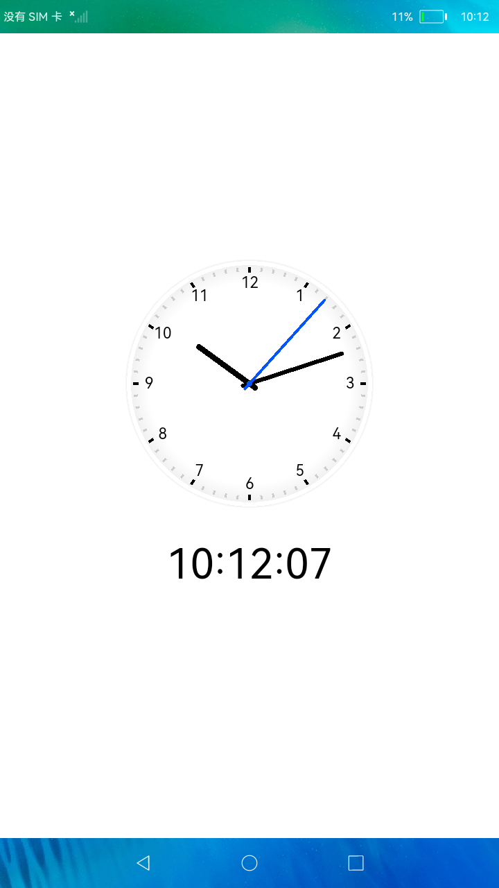

# 简单时钟

### 简介

本示例使用eTS UI能力实现一个简单的时钟应用。实现效果如下：

### 相关概念

- CanvasRenderingContext2D：使用RenderingContext在Canvas组件上进行绘制，绘制对象可以是矩形、文本、图片等。

### 相关权限

不涉及

### 使用说明

1.界面通过setInterval实现周期性实时刷新时间，使用Canvas绘制时钟，指针旋转角度通过计算得出。

例如："2 * Math.PI / 60 * second"是秒针旋转的角度。

### 约束与限制

1.本示例仅支持标准系统上运行。

2.本示例为Stage模型，从API version 9开始支持。

3.本示例需要使用DevEco Studio 3.0 Beta3 (Build Version: 3.0.0.901, built on May 30, 2022)才可编译运行。