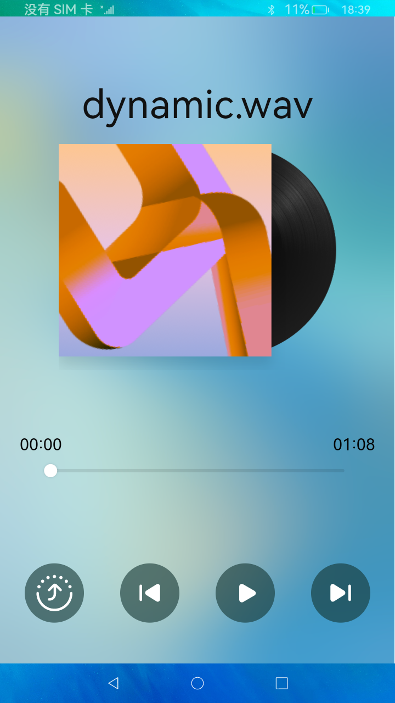

# 分布式音乐播放

### 简介

本示例使用fileIo获取指定音频文件，并通过AudioPlayer完成了音乐的播放完成了基本的音乐播放、暂停、上一曲、下一曲功能；并使用DeviceManager完成了分布式设备列表的显示和分布式能力完成了音乐播放状态的跨设备迁移。实现效果如下：

### 相关概念

音频播放：媒体子系统包含了音视频相关媒体业务，通过AudioPlayer实现音频播放的能力。

数据流转：分布式数据管理为应用程序提供不同设备间数据库的分布式协同能力。通过调用分布式数据各个接口，应用程序可将数据保存到分布式数据库中，并可对分布式数据库中的数据进行增/删/改/查等各项操作。

### 相关权限

本示例需要在module.json5中配置如下权限:

     "requestPermissions": [
      {
        "name": "ohos.permission.DISTRIBUTED_DATASYNC",
        "reason": "$string:distributed_permission",
        "usedScene": {
          "abilities": [
            "MainAbility"
          ],
          "when": "inuse"
        }
      }
    ]

### 使用说明

1.**音乐播放**，点击**播放**、**暂停**、上**一曲**、下**一曲**按钮可以对音乐进行操作。

2.**跨设备迁移播放**，组网条件下，点击**流转**按钮，选择设备，拉起对端设备上的音乐，本端退出。

### 约束与限制

1.本示例仅支持标准系统上运行。

2.本示例为stage模型，从API version 9开始支持。

3.本示例需要使用3.0.0.901及以上的DevEco Studio版本才可编译运行。