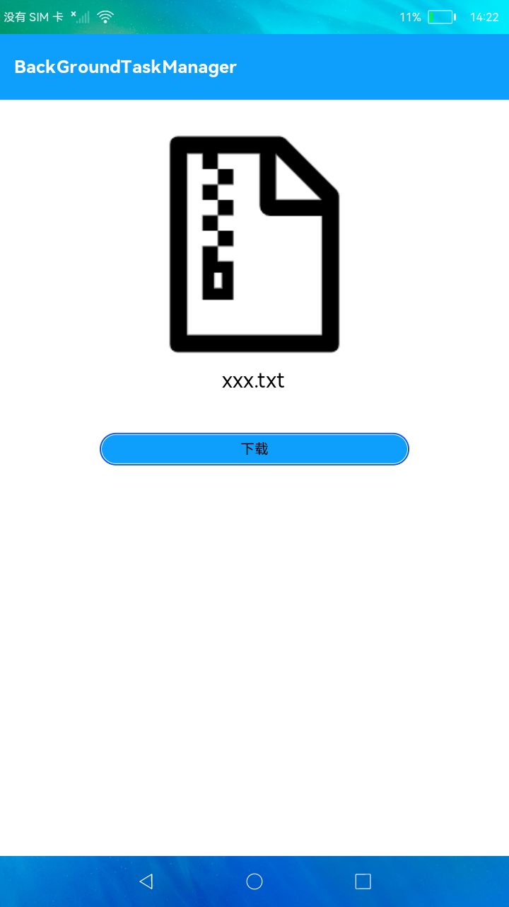

# 后台任务管理

### 简介

本示例模拟下载功能，将下载任务通过后台任务管理进行处理，实现退出应用后任务仍能够执行，直至任务结束。



### 相关概念

当应用或业务模块处于后台（无可见界面）时，如果有需要继续执行或者后续执行的业务，可基于业务类型，申请短时任务延迟挂起（Suspend）或者长时任务避免进入挂起状态

### 相关权限

```
本示例需要在config.json中配置如下权限:

后台任务管理权限：ohos.permission.KEEP_BACKGROUND_RUNNING
```

### 使用说明

1.点击**下载**按钮，退出应用，将下载任务推送到后台执行。当任务在后台开始执行时会有通知提醒，且有下载任务进度显示。

### 约束与限制

1.本示例仅支持在标准系统上运行。

2.查看下载进度时需要刷新通知窗口。

3.从API version 9开始支持。

4.本示例需要使用DevEco Studio 3.0 Beta3 (Build Version: 3.0.0.901, built on May 30, 2022)才可编译运行。