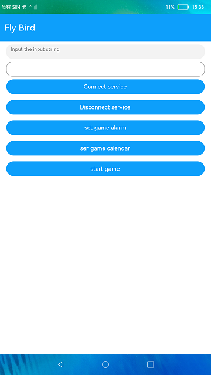
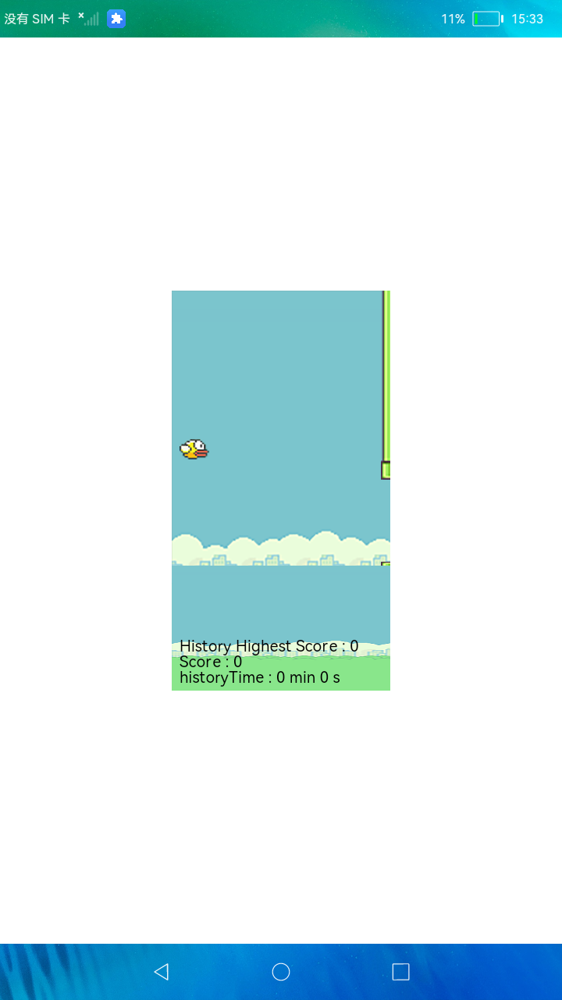

# 小鸟避障游戏

### 简介

本示例用于验证OpenHarmony提供的FA模型，Canvas组件、media组件做小游戏的能效是否符合预期，以及验证资源调度子系统的API接口是否符合后台规范运行的

预期。实现效果如下：

### 相关概念

-  Canvas：提供画布组件，用于自定义绘制图形。

### 相关权限

不涉及

### 使用说明

1.点击**ConnectService**按钮，创建一个ServiceAbility并连接。

2.点击**DisconenctService**按钮，断开ServiceAbility。

3.点击**set game alarm**按钮，利用闹钟提醒代理API，验证游戏进程在收到闹铃通知时不被拉起。

4.点击**set game calendar**按钮，利用日历提醒代理API，验证游戏进程在收到日历通知时不被拉起。

5.点击**start game**前，下载一个音频文件，重命名为12664.mp3，通过hdc file send 12664.mp3 /data/，
点击**start game**利用了后台长时任务API播放了一个音乐，验证应用退到后台后能否正常播放。选择对应
的游戏难度1-5关玩游戏，游戏玩的过程中会利用后台信息统计API统计展示游戏在线时长。

6.点**home**按钮后，应用生命周期为onInactive, 在此回调中起一个短时任务，验证短时任务API能否正常执行。

### 约束与限制

1.本示例仅支持在标准系统上运行。

2.从API version 9开始支持。

3.本示例需要使用DevEco Studio 3.0 Beta3 (Build Version: 3.0.0.901, built on May 30, 2022)才可编译运行。