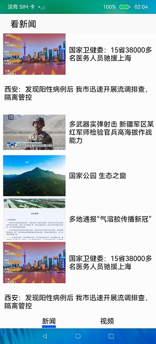
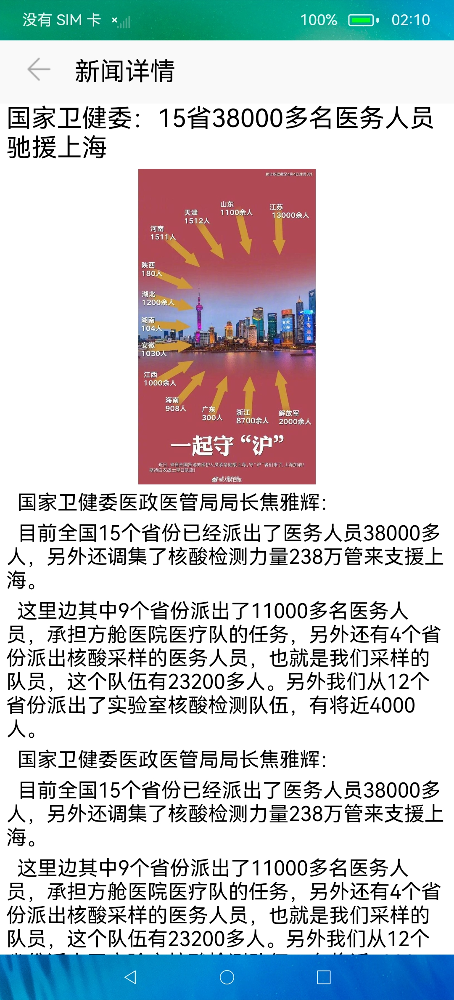
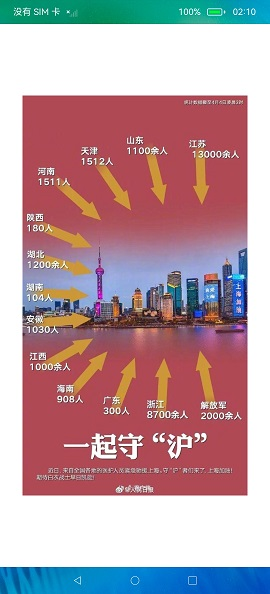

# 文档管理

### 简介

本示例用于验证OpenHarmony的启动、跳转、滑动等场景性能体验是否响应及时、动画流畅。

### 使用说明

1.点击应用图标启动应用。

2.应用主页滑动。

3.主页内点击任意一条新闻进行跳转，到新闻详情页面，进行滑动浏览操作。

4.新闻详情页面点击图片，进入图片页面，可双指放大缩小图片，放大时可左右拖动图片进行查看。

5.再次点击图片返回新闻详情页面，在新闻详情页面点击左上角返回按钮返回主页。

6.主页的新闻和视频tab页可来回切换，其中视频页的视频需要将本地视频xxx.mp4通过命令推到手机中，命令如下：
  ```
  hdc file send xxx.mp4 /data/accounts/account_0/appdata/video1.mp4 
  ```

### 约束与限制

1.本示例仅支持在标准系统上运行。

2.从API version 9开始支持。

3.本示例需要使用3.0.0.900及以上的DevEco Studio版本才可编译运行。

### 运行结果截图：








