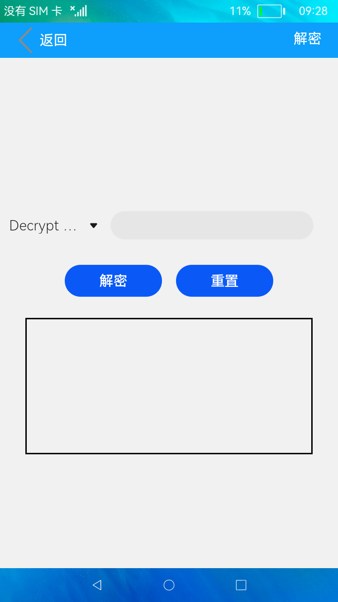

# 加解密

### 简介

本示例展示了加解密算法，包括RSA加密算法与AES加密算法。效果图如下：

### 相关概念

- [RSA加密算法](https://gitee.com/openharmony/docs/blob/master/zh-cn/application-dev/reference/apis/js-apis-system-cipher.md)：RSA公开密钥密码体制是一种使用不同的加密密钥与解密密钥，由已知加密密钥推导出解密密钥在计算上是不可行的密码体制。

- [AES加密算法](https://gitee.com/openharmony/docs/blob/master/zh-cn/application-dev/reference/apis/js-apis-system-cipher.md)：AES密码学中的高级加密标准，又称Rijndael加密法，是美国联邦政府采用的一种区块加密标准。

### 相关权限

不涉及

### 使用说明

1.点击主页面的**加密**按钮，在加密界面中点击**Encryption Algorithm**下拉选择加密算法，在输入框中输入待加密的内容，点击**加密**
按钮，下方文本框中显示加密后内容。

2.点击**重置**按钮，清除文本框中内容。

3.点击主页面的**解密**按钮，在解密界面中点击**Decrypt Algorithm**下拉选择解密算法，在输入框中输入待解密的内容，点击**解密**
按钮，下方文本框中显示解密后内容。

4.点击**重置**按钮，清除文本框中内容。

### 约束与限制

本示例支持在标准系统上运行，本示例需要使用3.0.0.901及以上的DevEco Studio版本才可编译运行。

