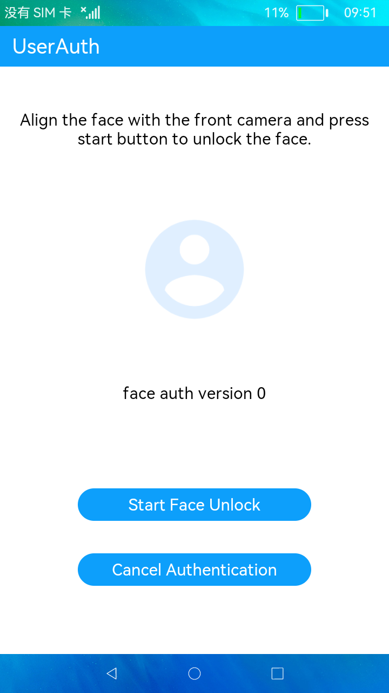

# 用户认证

### 简介

本示例展示了用户认证中人脸识别功能。实现效果如下：

### 相关概念

用户认证：提供了用户认证的相关方法，包括检测认证能力、认证和取消认证等，用户可以使用人脸等生物特征信息进行认证操作。

### 相关权限

访问生物识别权限：ohos.permission.ACCESS_BIOMETRIC

### 使用说明

1.进入首页，会检测当前设备是否支持人脸识别并弹框提示。

2.点击**Start Face Unlock**按钮，开始人脸识别，识别结果弹框提示。

3.点击**Cancel Authentication**按钮，取消人脸识别，取消结果弹框提示。

### 约束与限制

1.本示例仅支持在标准系统上运行。

2.本示例仅支持有人脸识别能力的设备上测试，且人脸识别只为打桩，功能暂不支持。

3.本示例为Stage模型，从API version 9开始支持。

4.本示例需要使用DevEco Studio 3.0 Beta3 (Build Version: 3.0.0.901, built on May 30, 2022)才可编译运行。
