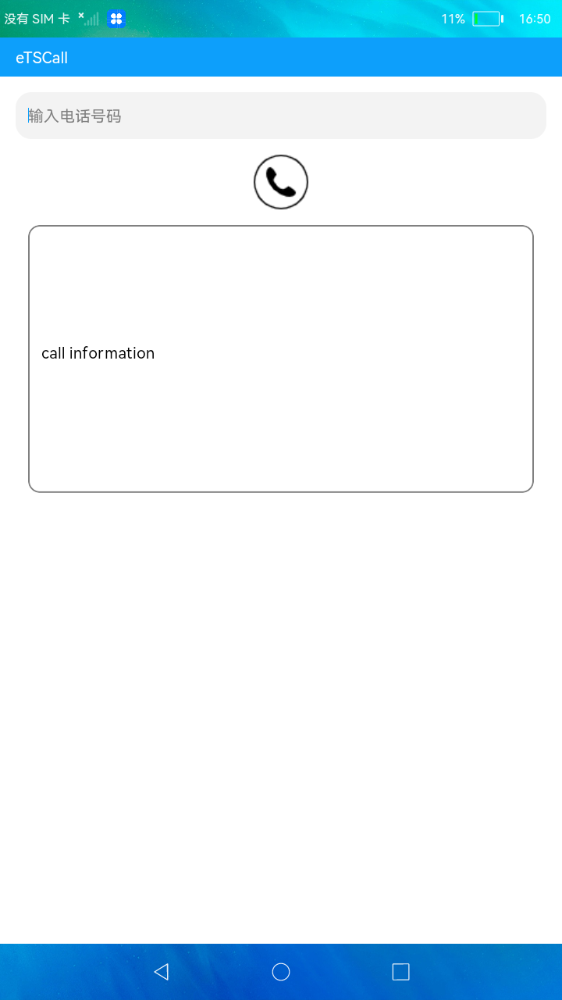

# 拨打电话

### 简介

本示例通过输入电话，进行电话拨打，及电话相关信息的显示。实现效果如下：

### 相关概念

页面路由：页面路由需要在页面渲染完成之后才能调用，在onInit和onReady生命周期中页面还处于渲染阶段，禁止调用页面路由方法。
弹窗：文本提示框。

### 相关权限

拨打电话权限: ohos.permission.PLACE_CALL

### 使用说明

1.输入电话号码后，点击**电话**按钮，进行拨打电话。

2.拨打电话后文本框会显示拨打是否成功，是否存在通话，通话状态，是否紧急号码，格式化后的电话号码。

### 约束与限制

1.本示例仅支持在标准系统上运行。

2.本示例需要使用DevEco Studio 3.0 Beta3 (Build Version: 3.0.0.901, built on May 30, 2022)才可编译运行。
