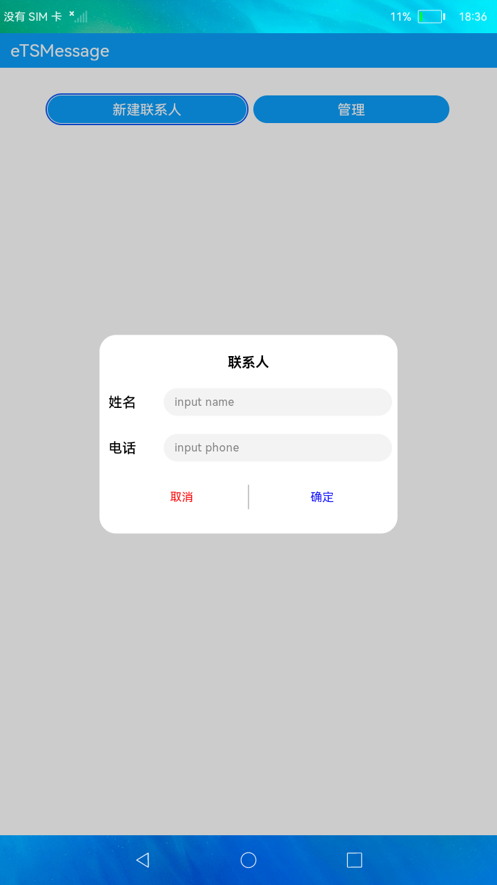
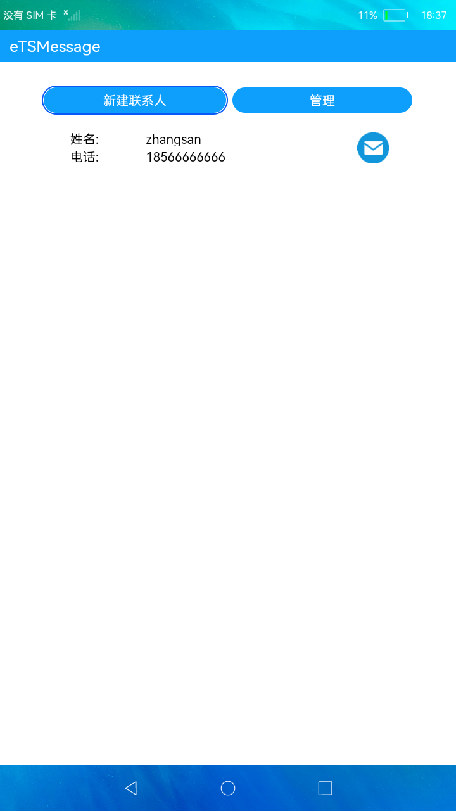
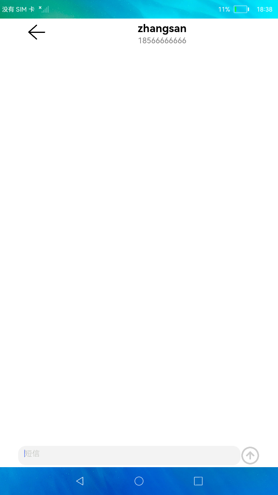

# 短信服务

### 简介

本示例展示了电话服务中发送短信的功能。实现效果如下：

### 相关概念

发送短信、获取发送短信的默认SIM卡槽ID、获取短信服务中心（SMSC）地址等。

### 相关权限

发送短信权限：ohos.permission.SEND_MESSAGES
设置通话状态权限：ohos.permission.SET_TELEPHONY_STATE
获取通话状态权限：ohos.permission.GET_TELEPHONY_STATE

### 使用说明

1.首页点击**创建联系人**，弹框输入联系人姓名和电话，点击确定按钮后，联系人列表中添加该联系人。

2.点击**管理**，该按钮变成**取消**，联系人列表出现删除x按钮，点击x按钮可删除联系人，点击**取消**，按钮变成**管理**。

3.联系人列表中每个联系人右侧有**发送短信**图标按钮，点击该图标按钮跳转到发送短信页面。

4.发送短信页面，输入短信点击向上箭头的**发送**按钮，可以发送短信。

5.需授予短信发送权限且插入SIM卡才可成功发送短信，有预置短信内容，每次退出应用数据会清空，未添加存储功能，发送短信为默认卡发送。

### 约束与限制

1.本示例仅支持在标准系统上运行。

2.本示例需要使用DevEco Studio 3.0 Beta3 (Build Version: 3.0.0.901, built on May 30, 2022)才可编译运行。