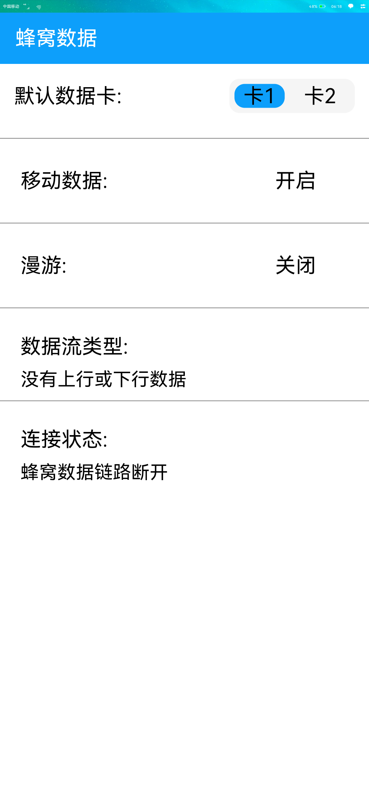

# 蜂窝数据

### 简介

本示例通过获取SIM卡相关信息，简要说明蜂窝数据接口相关功能。。效果图如下：

### 相关概念

- [网络状态](https://gitee.com/openharmony/docs/blob/master/zh-cn/application-dev/reference/apis/js-apis-system-network.md)：网络状态相关功能。

### 相关权限

网络服务：ohos.permission.GET_NETWORK_INFO

### 使用说明

1.默认移动数据的SIM卡背景色显示为蓝色。

2.若已经开启移动数据，则显示开启，否则显示为关闭。

3.若已经开启漫游服务，则显示开启，否则显示为关闭。

4.检测打开本应用时默认移动数据SIM卡的数据流状态并显示。

5.检测打开本应用时默认移动数据SIM卡的蜂窝数据链路连接状态并显示。

### 约束与限制

1.本示例仅支持在标准系统上运行。

2.本示例需设备支持SIM卡功能，且插入SIM卡。

3.本示例为Stage模型，从API version 9开始支持。

4.本示例需要使用DevEco Studio 3.0 Beta3 (Build Version: 3.0.0.901, built on May 30, 2022)才可编译运行。