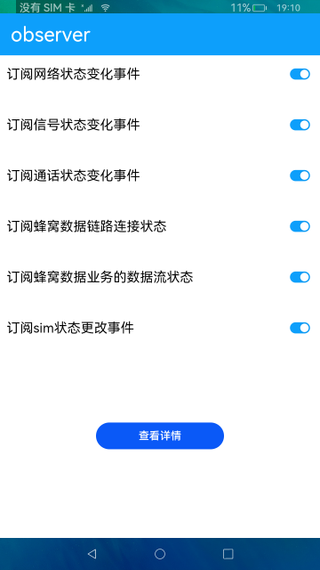

# observer

### 简介

本示例通过observer接口订阅网络状态、信号状态、通话状态、蜂窝数据、sim状态等事件，并获取状态变化返回的结果。

### 相关概念

@ohos.telephony.observer: 通过注册相关监听事件，来监听手机网络、信号、通话、sim卡等状态，并返回相应的结果。

### 相关权限

本示例需要在module.json5中配置如下权限:

获取网络状态权限:ohos.permission.GET_NETWORK_INFO

获取通话状态权限:ohos.permission.READ_CALL_LOG

### 使用说明

1.打开应用，开启所有订阅事件开关。

2.开关一次网络，触发网络状态变化。

3.拨打一次电话，触发通话状态变化。

4.插拔一次sim卡，触发sim卡状态变化和信号状态变化。

5.点击**查看详情**按钮，跳转详情页，显示监听到的数据结果。

### 约束与限制

1.本示例仅支持标准系统上运行。

2.本示例为Stage模型，从API version 9开始支持。

3.本示例需要使用DevEco Studio 3.0 Beta3 (Build Version: 3.0.0.901, built on May 30, 2022)才可编译运行。