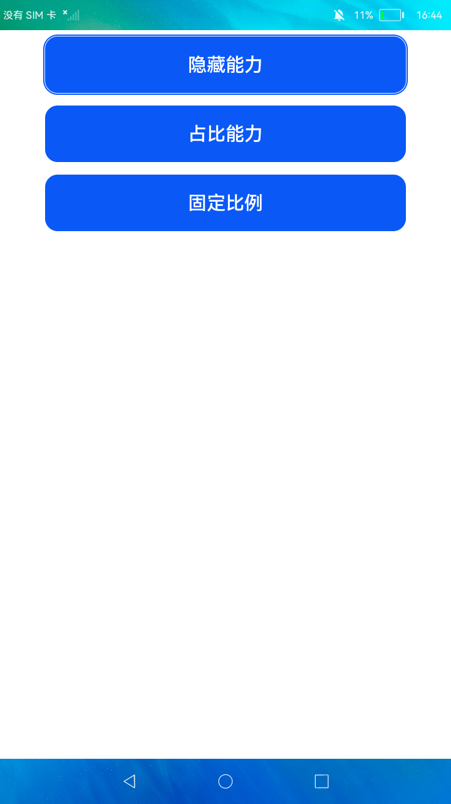

# 原子布局

### 简介

本示例展示了布局效果自适应的相关样式属性，包括隐藏能力、占比能力和固定比例。

实现效果如下：

### 相关概念

-  隐藏能力：可以调整组件内元素水平/垂直方向的显示优先级。

-  占比能力：可以调整指定元素始终在容器的某一比例空间中进行布局。

-  固定比例：可以以固定的比例调整组件的宽高尺寸。

### 相关权限

不涉及

### 使用说明

1.本示例主界面为三个按钮，点击后在新页面分别展示。

2.在能力展示页面中，浅黄色背景为父容器，A、B、C为其中三个子元素，点击**按钮**可改变子容器大小，子元素显示会随之改变。

### 约束与限制

1.隐藏能力与占比能力需在非折行的flex布局中使用。

2.本示例支持在标准系统使用。

3.本示例需要使用DevEco Studio 3.0 Beta3 (Build Version: 3.0.0.901, built on May 30, 2022)才可编译运行。