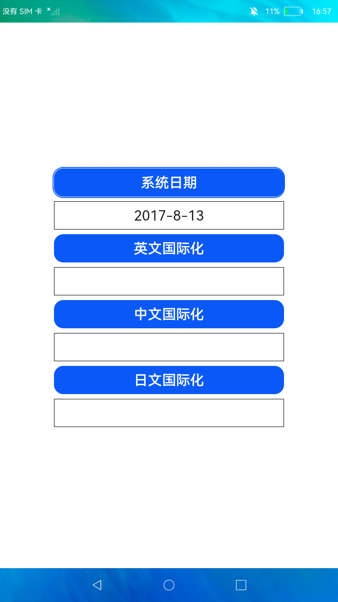

# 国际化

### 简介

不同地域，同一日期在国际化之后，拥有不同的格式。本示例展示了英国、中国、日本三个地域对同一日期进行国际化。

实现效果如下：

### 相关概念

-  TextClock：TextClock组件通过文本将当前系统时间显示在设备上。支持不同时区的时间显示，最高精度到秒级。

### 相关权限

不涉及

### 使用说明

应用直接获取系统当前时间

1.点击**英文国际化**，将获取到的系统时间进行英文国际化，展示英文格式的日期。

2.点击**中文国际化**，将获取到的系统时间进行中文国际化，展示中文格式的日期。

3.点击**日文国际化**，将获取到的系统时间进行日文国际化，展示日文格式的日期。

### 约束与限制

1.本示例仅支持在标准系统上运行。

2.本示例需要使用DevEco Studio 3.0 Beta3 (Build Version: 3.0.0.901, built on May 30, 2022)才可编译运行。