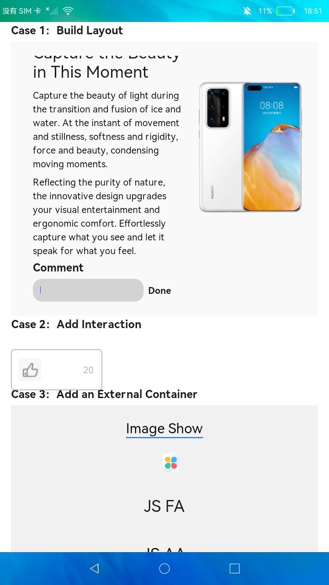

# Js组件

### 简介

本示例适用于介绍如何使用組件开发一个用戶界面 ，组件 Component 是构建页面的核心，每个组件通过对数据和方法的简单封装，实现独立的可视、可交互功能单元。

### 相关概念

[基于JS扩展的类Web开发范式](https://gitee.com/openharmony/docs/tree/master/zh-cn/application-dev/reference/arkui-js)：JavaScript相关组件。

### 相关权限

不涉及

### 使用说明

通过滑动列表，点击组件，查看各组件的视图效果和点击效果，以及与组件交互的实现方法。 组件之间相互独立，可以在需求相同的地方重复使用。

### 约束与限制

1.本示例仅支持在标准系统上运行。

2.本示例需要使用DevEco Studio 3.0（Beta3Build Version: 3.0.0.901, built on May 30, 2022)才可编译运行。