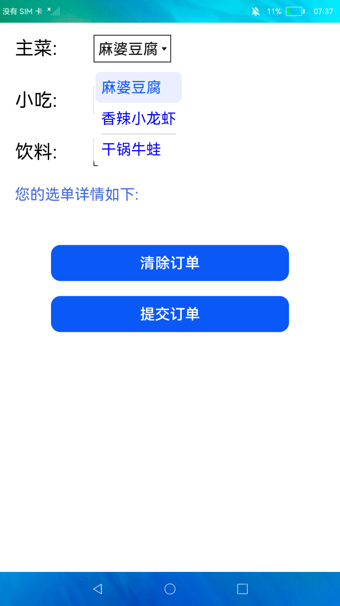

# 菜单

### 简介

本示例展示了JS中<menu\>和<option\>组件的使用，<option\>可作为<menu\>和<select\>的子组件。开发者可自行定义控件的位置、样式、响应事件等属性信息。

在点击控件后会弹出相应的菜单，用户可以点击菜单选项进行选择。实现效果如下：

### 相关概念

- option：当作为<menu\>和<select\>的子组件时用来展示弹出菜单的具体项目。
- menu：提供菜单组件，作为临时性弹出窗口，用于展示用户可执行的操作。
- select：下拉选择按钮，可让用户在多个选项之间选择。

### 相关权限

不涉及

### 使用说明

1.点击**菜单选项**进入菜单选项界面，此界面使用<option\>作为<menu\>的子组件展示了主菜、小吃、饮料三个菜单，点击对应文本会弹出菜单，点击菜单选项可以进行选择，选择的内容会显示在底部选单详情中。点击**清除订单**可以清空选单详情中的内容，点击**提交订单**会弹出提交订单成功的提示并清除选单详情中的内容。

2.点击**选择选项**进入选择选项界面，此界面使用<option\>作为<select\>的子组件展示了主菜、小吃、饮料三个菜单，点击对应文本会弹出菜单，点击菜单选项可以进行选择，选择的内容会显示在底部选单详情中。点击**清除订单**可以清空选单详情中的内容，点击**提交订单**会弹出提交订单成功的提示并清除选单详情中的内容。

### 约束与限制

1.本示例支持标准系统上运行。

2.本示例需要使用DevEco Studio 3.0 Beta3 (Build Version: 3.0.0.901, built on May 30, 2022)才可编译运行。
