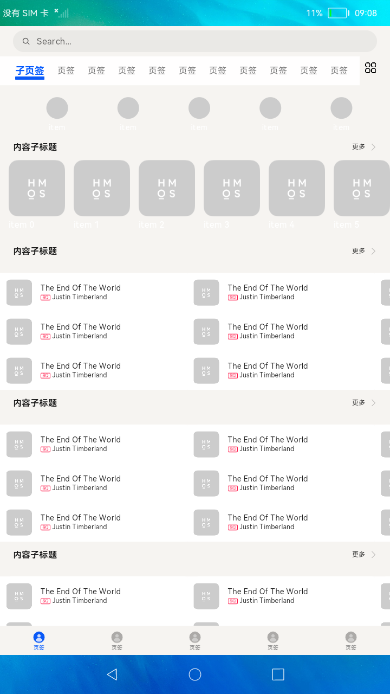

# 多设备自适应的FA页面

### 简介

本示例构建了常见应用的信息展示页面，包含搜索栏，列表展示。在不同尺寸的设备上，通过拉伸、缩放、隐藏、均分、占比等自适应能力，使用多态控件、布局和组件的延展性以及响应式布局的运用，自适应展示为合理的布局效果。

实现效果如下：

### 相关概念

-  资源限定与访问：资源限定词可以由一个或多个表征应用场景或设备特征的限定词组合而成，包括屏幕密度等维度，限定词之间通过中划线（-）连接，开发者在resources目录下创建限定词文件。

-  原子布局：在屏幕形态和规格不同等情况下，布局效果需要实现自适应，因此系统提供了面向不同屏幕尺寸界面自适应适配的布局能力，称为原子布局。

-  响应式布局：通过使用快应用的响应式布局能力开发新应用或者改造已有应用，可以使快应用在手机、平板、智慧屏等各种尺寸的设备都有良好的展示效果。

### 相关权限

不涉及

### 使用说明

1.点击**tab-bar**按钮进行页面切换，可上下滑动内容页，左右滑动列表查看隐藏内容。

2.开发者可将本示例安装到不同类型设备上，查看自适应效果。

### 约束与限制

1.本示例仅支持在大型系统上运行。

2.本示例需要使用DevEco Studio 3.0 Beta3 (Build Version: 3.0.0.901, built on May 30, 2022)才可编译运行。