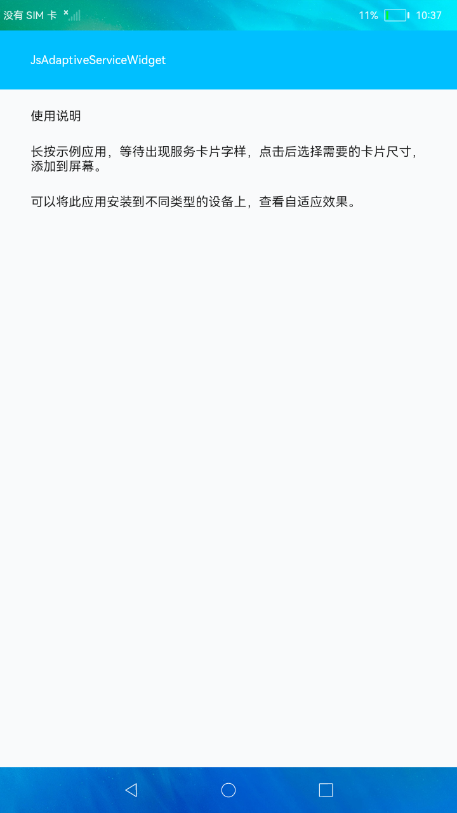
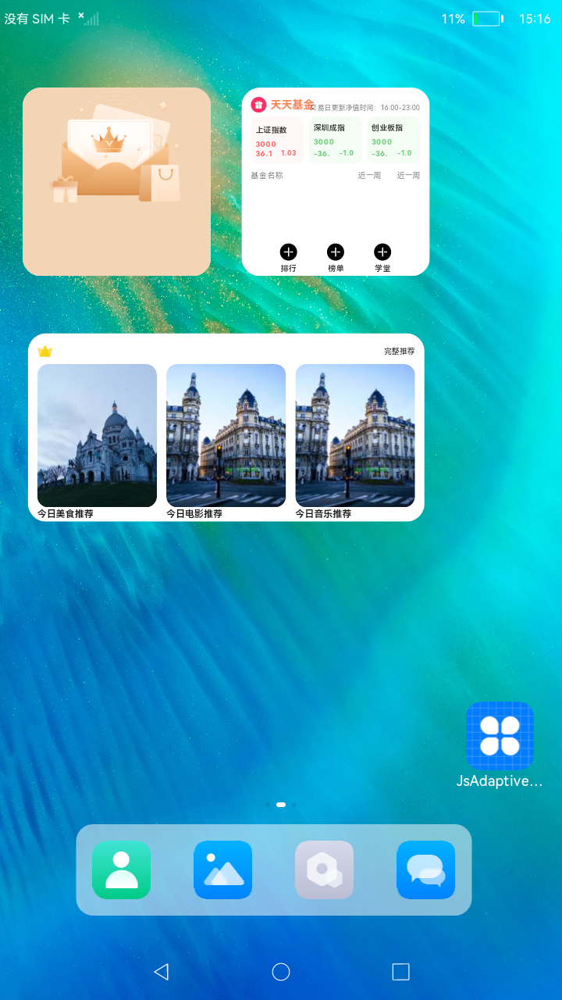

#  多设备自适应服务卡片

### 简介

本示例分别通过沉浸式卡片、图文卡片、宫格卡片、纯文本卡片、多维度信息卡片五种类型，展示了卡片在不同尺寸设备上的自适应能力。当卡片在极宽和极高的情况下，通过拉伸、缩放、隐藏、折行、均分等自适应能力将卡片展示出来。效果图如下：

### 相关概念

- [Ability开发](https://gitee.com/openharmony/docs/blob/master/zh-cn/application-dev/ability/Readme-CN.md)：Ability开发概述。

### 相关权限

不涉及

### 使用说明

长按示例应用，等待出现服务卡片字样，点击后可左右滑动选择需要的卡片尺寸，添加到屏幕。

### 约束与限制

1.本示例支持在标准系统上运行。

2.本示例需要使用DevEco Studio 3.0（Beta3Build Version: 3.0.0.901, built on May 30, 2022)才可编译运行。