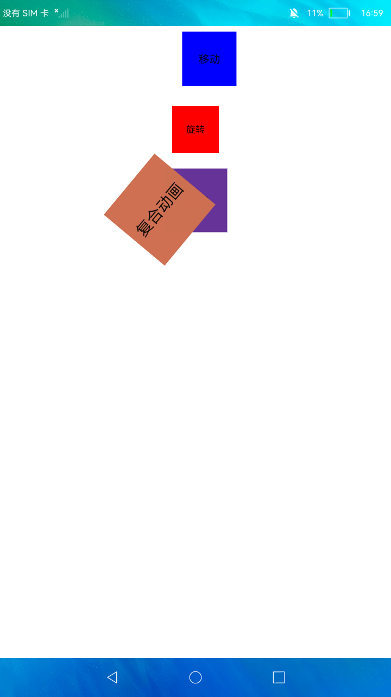

# 动画与自定义字体

### 简介

本示例展示了JS中动画样式，渐变样式，转场样式和自定义字体的效果及使用方法。

实现效果如下：

### 相关概念

-  动画样式：移动，旋转，缩放，复合动画。

-  渐变样式：线性渐变，重复性渐变 。

-  转场样式：共享元素样式，自定义页面转场样式，卡片转场样式。

-  自定义字体样式：引用otf字体文件实现（ttf字体使用同理）。

### 相关权限

不涉及

### 使用说明

1.本示例主界面为四个按钮，分别对应动画样式，渐变样式，转场样式和自定义字体样式。

2.进入各样式页面，点击**页面效果**按钮，展示对应效果（如**移动**按钮，展示移动动画效果）。

### 约束与限制

1.本示例仅支持在标准系统上运行。

2.本示例需要使用DevEco Studio 3.0 Beta3 (Build Version: 3.0.0.901, built on May 30, 2022)才可编译运行。

