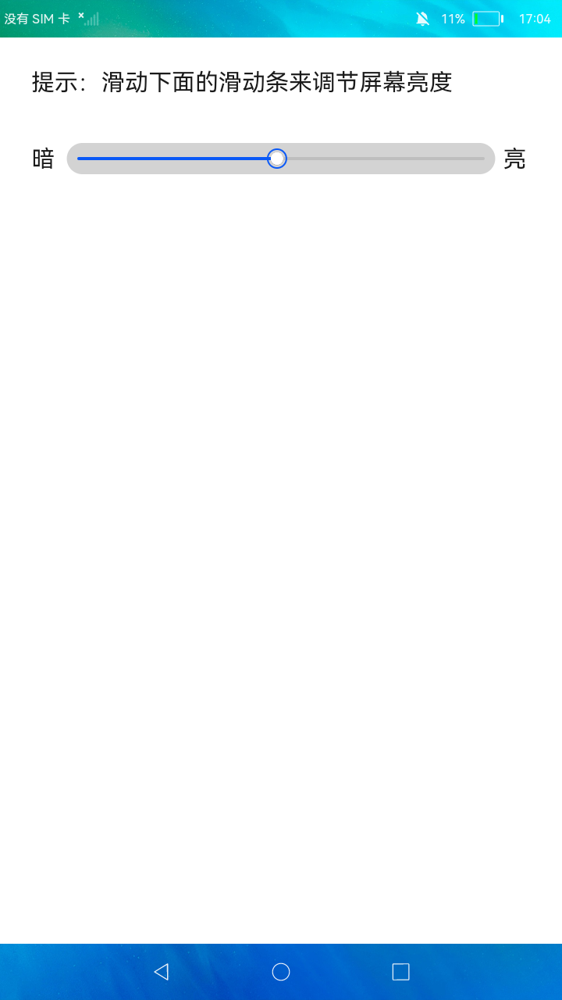

# 设置屏幕亮度

### 简介

本示例通过滑动条来调整屏幕亮度。实现效果如下：

### 相关概念

-  滑动条组件：用来快速调节设置值，如音量、亮度等。

### 相关权限

不涉及

### 使用说明

滑动页面上的滑动条来设置不同的屏幕亮度。

### 约束与限制

1.本示例仅支持在标准系统上运行。

2.本示例需要使用DevEco Studio 3.0 Beta3 (Build Version: 3.0.0.901, built on May 30, 2022)才可编译运行。

